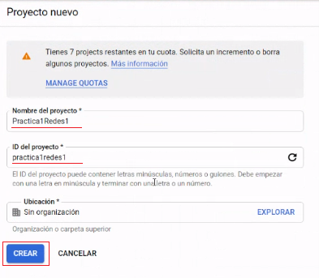
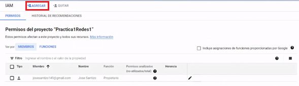
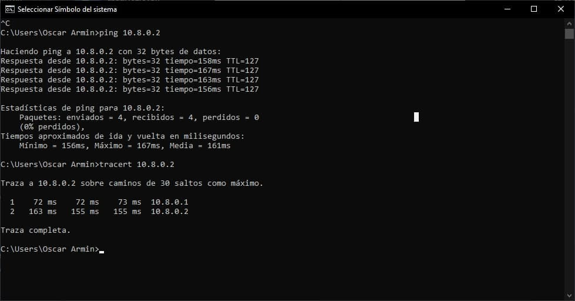

<!-- START doctoc generated TOC please keep comment here to allow auto update -->
<!-- DON'T EDIT THIS SECTION, INSTEAD RE-RUN doctoc TO UPDATE -->
**Table of Contents**  *generated with [DocToc](https://github.com/thlorenz/doctoc)*

- [Practica 1](#practica-1)
      - [Guatemala 06 de Agosto 2021](#guatemala-06-de-agosto-2021)
- [Tabla de Contenido](#tabla-de-contenido)
- [**1. Creación de Proyecto**](#1-creaci%C3%B3n-de-proyecto)
- [**2. Configuraciones de IAM**](#2-configuraciones-de-iam)
  - [**2.1. Agregar Miembros**](#21-agregar-miembros)
  - [**2.2. Aceptar Invitación**](#22-aceptar-invitaci%C3%B3n)
  - [**2.3. Estado de Miembros**](#23-estado-de-miembros)
- [**3. Crear Máquina Virtual**](#3-crear-m%C3%A1quina-virtual)
- [**4. Instalaciones en la Maquina**](#4-instalaciones-en-la-maquina)
- [**5. Instalacion de OpenVPN**](#5-instalacion-de-openvpn)
- [**6. Configuracion de OpenVPN**](#6-configuracion-de-openvpn)
- [**7. Politicas de FireWall**](#7-politicas-de-firewall)
- [**8. Conexion a VPN**](#8-conexion-a-vpn)
- [**9. Comprobaciones VPN**](#9-comprobaciones-vpn)

<!-- END doctoc generated TOC please keep comment here to allow auto update -->

Universidad de San Carlos de Guatemala
 
Facultad de Ingeniería
 
Escuela de Ciencias y Sistemas
 
Redes de Computadoras 1
 
Ing. Miguel Marin de León
 
Aux. Juan Pablo García Monzón

    

<h1 align="center" style="font-size: 40px; font-weight: bold;">Practica 1</h1>

   

| Carnet | Nombre |
| :-: | :-:| 
| 201700965 | José Carlos I Alonzo Colocho |
| 201700319 | Estanley Rafael Cóbar García |
| 201709140 | Oscar Armin Crisostomo Ruiz |
| 201709309 | José Alejandro Santizo Cotto  |

  

<h4 align="center" style="font-size: 18px; font-weight: bold;">Guatemala 06 de Agosto 2021</h4>

*** 

    

*** 

<h1>Tabla de Contenido</h1>

- [**1. Creación de Proyecto**](#1-creación-de-proyecto)
- [**2. Configuraciones de IAM**](#2-configuraciones-de-iam)
  - [**2.1. Agregar Miembros**](#21-agregar-miembros)
  - [**2.2. Aceptar Invitación**](#22-aceptar-invitación)
  - [**2.3. Estado de Miembros**](#23-estado-de-miembros)
- [**3. Crear Máquina Virtual**](#3-crear-máquina-virtual)
- [**4. Instalaciones en la Maquina**](#4-instalaciones-en-la-maquina)
- [**5. Instalacion de OpenVPN**](#5-instalacion-de-openvpn)
- [**6. Configuracion de OpenVPN**](#6-configuracion-de-openvpn)
- [**7. Politicas de FireWall**](#7-politicas-de-firewall)
- [**8. Conexion a VPN**](#8-conexion-a-vpn)
- [**9. Comprobaciones VPN**](#9-comprobaciones-vpn)

  

*** 
# **1. Creación de Proyecto**

1.1. Ingresar al sitio web [CloudGoogle.com](https://cloud.google.com "Cloud Google") e iniciar sesión con cuenta Gmail. En la imagen 1.1. se muestra la barra de navegación donde se debe hacer clic en ***consola*** para ir a la pagina principal de ***Google Cloud Platform*** como se muestra en la imagen 1.2.

 

Imagen 1.1. Barra de Navegación luego de haber iniciado sesión.

 

Imagen 1.2. Interfaz principal de Google Cloud Platform

 

1.2.	Para la creación de un nuevo proyecto debemos de ir a la barra de navegación y hacer clic en ***My First Project*** (ver imagen 1.3.).
  - **NOTA**: el nombre de ***My First Project*** puede cambiar si existen otros proyectos creados y se mostrará un nombre aleatorio de los proyectos creados.

Imagen 1.3. Barra de Navegación para crear un nuevo proyecto.

1.3.	Se desplegará una nueva tarjeta en donde se pueden ver los proyectos que hayan sido creados y también donde podemos escoger la opción de escoger ***Proyecto Nuevo*** la cual nos interesa y en la cual debemos hacer clic. (Ver imagen 1.4.)

Imagen 1.4. Interfaz para poder Seleccionar Proyecto o Crear un Proyecto Nuevo.

 

1.4.	Se desplegará una nueva tarjeta para poder crear nuestro **Proyecto Nuevo**, se debe llenar el formulario, en este caso el nombre del proyecto. El id del proyecto se creará automático al momento de ingresar el nombre de nuestro proyecto, pero si es necesario se puede cambiar. Al haber  completado el formulario, creamos nuestro nuevo proyecto. (Ver Imagen 1.5.)

 

Imagen 1.5. Interfaz para creación de proyecto

 

Imagen 1.6. Proyecto creado correctamente.

 

1.5. Luego de haber creado nuestro proyecto, se debe mostrar la interfaz del proyecto.

 

Imagen 1.7. Interfaz del proyecto creado.

   

*** 
# **2. Configuraciones de IAM**

*** 
## **2.1. Agregar Miembros**
*** 

2.1.1.	Ir al menú desplegable del extremo izquierda de la interfaz del proyecto y seleccionar la opción ***IAM y Administración*** y luego ***IAM*** como se muestra en la Imagen 2.1.1.

- ***NOTA:*** el menú desplegable izquierdo en algunos casos no se muestra, lo que se debe hacer es click en el icono que esta en la parte izquierda de la barra de navegación y al lado izquierdo donde dice ***Google Cloud Platform***.

 

Imagen 2.1.1. Selección de opción IAM.

 

2.1.2.	Luego de haber seleccionado la opción de IAM debemos de poder agregar a todos los usuarios que formaran parte de este proyecto, para esto debemos hacer clic en la opción  señalada con el cuadro rojo en la imagen 2.1.2.

 

Imagen 2.1.2. Agregar usuarios IAM.

 

2.1.3.	Se desplegará una nueva interfaz para poder agregar a los miembros del proyecto, para esto debemos ingresar los correos electrónicos de los nuevos miembros y también poder seleccionar su función dentro del proyecto, ya que este es un proyecto de red todos los usuarios agregados tendrán la función de propietario (Ver Imagen 2.1.3.) también debemos de marcar la opción de ***Enviar un correo electrónico de notificación*** para que realice esa opción (Ver imagen 2.1.4.). Luego debemos guardar los cambios realizados.

 

Imagen 2.1.3. Seleccionar función del miembro.

 

Imagen 2.1.4. Agregar miembros al proyecto.

 

2.1.4.	Cuando acabemos de guardar los cambios se muestra en la interfaz IAM una tabla con todos los miembros agregados al proyecto (ver Imagen 2.1.5). Si los usuarios en la parte de función aparecen con un triangulo amarrillo eso significa que no han aceptado la solicitud de ser miembro del proyecto.

 

Imagen 2.1.5. Tabla Miembros agregados al proyecto.

  

*** 
## **2.2. Aceptar Invitación**
*** 

2.2.1.	El usuario debe ir al correo con el que fue registrado al proyecto como miembro y verificar en su bandeja de entrada dicho correo y abrir el correo (Ver imagen 2.2.1.) y hacer clic en el enlace (url) enviado. 

 

Imagen 2.2.1. Correo electrónico de invitación para unirse al proyecto.

 

2.2.2.	El enlace nos direccionará a una página en donde debemos colocar nuestro país y marcar la opción para aceptar las condiciones del servicio y proyecto, si queremos aceptar la invitación al proyecto o en caso contrario rechazamos la invitación. Para este proyecto es claro que aceptaremos la invitación. 

 

Imagen 2.2.1. Interfaz para Aceptar o Rechazar invitación del proyecto

  

*** 
## **2.3. Estado de Miembros**
*** 

Los usuarios que hayan aceptado la invitación del proyecto ya no tendrán el triangulo amarrillo a la derecho de su función (Ver Imagen 2.3)

- ***Nota:*** Si la invitación es rechazada el nombre del usuario desaparece de la tabla. 

 

Imagen 2.3. Tabla de miembros del proyecto

  

*** 
# **3. Crear Máquina Virtual**

3.1.	Dirigirse ir al menú desplegable del extremo izquierda de la página del proyecto y seleccionar la opción ***Compute Engine*** y luego la opción ***instancia de VM*** como se muestra en la Imagen 3.1. 
- ***VM*** = Virtual Machine - Máquina Virtual

 

Imagen 3.1. Opción Instancias de VM

 

3.2.	Habilitar opción ***Compute Engine API*** como se muestra en la imagen 3.2.

 

Imagen 3.2. Habilitar Compute Engine API

 

3.3.	Luego de concluir la habilitación de la opción de ***Compute Engine API***, se muestra la interfaz de ***Instancias de VM*** Para poder crear una nueva VM en el proyecto. (ver Imagen 3.3.)

 

Imagen 3.3. interfaz de Instancias VM.

 

3.4.	Para crear una nueva Máquina Virtual hacer clic en el botón ***Crear Instancia***. (Ver imagen 3.4.)

 

Imagen 3.4. Crear nueva instancia de VM

 

3.5.	Llenar los campos necesarios del formulario para crear la nueva instancia de VM, en este caso los campos que nosotros llenaremos serán:

- ***Nombre:*** le colocaremos el nombre apropiado a la VM.
- ***Tipo de Máquina:*** seleccionaremos la maquina con los requerimientos mínimos, en este caso será e2-micro (2 CPU virtuales, 1 GB de memoria, ver Imagen 3.5.).
- ***Disco de Arranque:*** debemos escoger el Sistema Operativo para la VM en este caso se escoge una distribución de GNU/Linux. (ver imagen 3.6.)
- ***Firewall:*** habilitaremos ambos protocolos HTTP y HTTPS para la VM. (Ver imagen 3.6.)

Para Finalizar hacer clic en crear.

 

Imagen 3.5. Nombre y Tipo de máquina de VM

 

Imagen 3.6. Disco de Arranque y Firewall de VM

 

3.6.	Al terminar la creación de la nueva instancia de la VM se muestra en la interfaz de ***Instancias de VM*** una tabla con los datos de esta nueva máquina virtual creada. (Ver imagen 3.7.)

 

Imagen 3.7. Interfaz de Instancia VM creada correctamente.

  

*** 
# **4. Instalaciones en la Maquina**

4.1.	Arir la máquina virtual tenemos que ir a la columna Conectar de la tabla de la instancia de la VM creada y hacemos clic en SSH. (ver imagen 4.1.)

 

Imagen 4.1. Abrir VM

 

4.2.	Se abrirá una pestaña secundaria de nuestro navegador en donde se muestra la máquina virtual con el sistema operativo escogido. (ver imagen 4.2.)

 

Imagen 4.2. Interfaz de máquina virtual.

 

4.3.	Ejecutar el comando ***sudo apt-get update*** en consola (Ver imagen 4.3.)
- ***Nota:*** se realiza este comando debido que nuestro sistema operativo es una distribución de GNU/Linux.
- ***sudo apt-get update:*** sirve para actualizar los repositorios que definimos en el archivo /etc/apt/sources.list.

 

Imagen 4.3. Actualizar repositorios.

 

4.4. Instalar Wget con el comando ***sudo apt-get install wget*** y luego ingresar la letra "***y***" para continuar con al instalación. Para verificar que este nstalado ejecutar el comando ***wget -v***. (ver imagen 4.4.)
- ***wget:*** El comando wget es una popular utilidad de línea de comandos de Unix / Linux para obtener el contenido de la web. Es de uso gratuito y proporciona una forma no interactiva de descargar archivos de la web. 

 

Imagen 4.4. Instalación de Wget

  

*** 
# **5. Instalacion de OpenVPN**

  5.1 Descargar el archivo de OpenVPN con la ayuda de wget en la [**seccion 4**](#4-instalaciones-en-la-maquina) previamente instalado, con el siguiente comando ***sudo wget https://cubaelectronica.com/OpenVPN/openvpn-install.sh*** esperando el mensaje de que el archivo fue guardado corectamente (ver imagen 5.1)

 

Imagen 5.1. Instalación de Wget

 

5.2 Comprobar que el archivo se encuentre en el lugar correcto con el comando ***ls*** (ver imagen )

- ***ls:*** El comando ls es uno de los comandos básicos, y su función principal es la de listar ficheros y directorios, por defecto alfabéticamente.

 

Imagen 5.2. Comprobacion de archivo

 

  

*** 
# **6. Configuracion de OpenVPN**

  6.1 Apertura de OpenVPN para la respetica configuracion con la cual se realiza con el comando ***sudo bash openvpn-install.sh*** (ver imagen 6.1)

 

Imagen 6.1. Apertura de OpenVPN

 

  6.2 Ingresar IP address solicitada por OpenVPN en el cual se debe ingresar la IP Externa que se encuentra en las instancias de las maquinas virtuales (ver imagen 6.2) para que se vea como la imagen 6.3

 

Imagen 6.2. IP interna

Imagen 6.3. Configuracion IP address

 

  6.3 Realizar el mismo procedimiento que se realizo con la IP interna con la IP publica o hostame que nos solicita igual se encuentra en la instancia de la maquina virtual  (ver imagen 6.4)

 

Imagen 6.4. Configuracion IP publica

 

 6.4 Seleccionar el protocolo que se desea tener para las conexiones OpenVPN  (ver imagen 6.5) el cual se debe utilizar el recomendado UDP
 - ***Protocolo UDP:*** El protocolo de datagramas de usuario, abreviado como UDP, es un protocolo que permite la transmisión sin conexión de datagramas en redes basadas en IP. Para obtener los servicios deseados en los hosts de destino, se basa en los puertos que están listados como uno de los campos principales en la cabecera UDP. Como muchos otros protocolos de red, UDP pertenece a la familia de protocolos de Internet, por lo que debe clasificarse en el nivel de transporte y, en consecuencia, se encuentra en una capa intermedia entre la capa de red y la capa de aplicación.

 

Imagen 6.5. Seleccion de protocolo

 

 6.5 Indicar el puerto que se desea para la VPN (ver imagen 6.6) 
  - ***Puertos:*** Un puerto VPN es una interfaz lógica que permite la transmisión de datos entre distintos ordenadores o redes a través de una VPN, o Red Privada Virtual. Una VPN es un aliado fundamental que nos permite asegurar mecanismos de protección para el acceso remoto a los datos corporativos, en el entorno actual de híper-movilidad.

 

Imagen 6.6. Seleccion de protocolo

 

 6.6 Seleccion del DNS que se desea usar en la vpn que se esta configurando (ver imagen 6.7) 
  - ***Puertos:*** DNS es el acrónimo para “Domain Name System” (sistema de nombre de dominio).
DNS es un servicio que habilita un enlace entre nombres de dominio y direcciones IP con la que están asociados, en otras palabras un traductor.

 

Imagen 6.7. Seleccion de DNS

 

 6.6 Indicacion de nombre para el certificado de clientes, esto siendo una sola palabra y sin caracteres especiales para la facil identificacion en la red.

 

Imagen 6.8. Indicacion nombre usuario

 

  

*** 
# **7. Politicas de FireWall**

  7.1 Antes de generar la VPN se deben configurar las plitucas de FireWall(politicas de cortafuegos) el cual se deben general en la seccion de Red de VPC que se encuentra en nuestra consola de la maquina virtual (ver imagen 7.1) en las que se deben crear las politicas tanto internas como externas (imagen 7.2 y 7.3)  
   - ***politicas de FireWall:*** Las políticas del cortafuegos le permiten bloquear o permitir determinados tipos de tráfico de red no especificados en una política de excepciones. Una política también define que funciones del cortafuegos se activan o desactivan. Asigne una política a uno o varios perfiles del cortafuegos.

 

Imagen 7.1. Opcion para creacion de politicas

Imagen 7.2. Politica allin

Imagen 7.3.Politica Allout

 

7.2. Revisar que las politicas se hayan creado y configurado correctamente en la seccion de politicas (ver imagen 7.4) para luego crear los archivos de cada usuario de la vpn (ver imagen 7.5) 

 

Imagen 7.4. Reglas creadas

Imagen 7.5. Archivo creado

  

*** 
# **8. Conexion a VPN**

8.1. Trasladar los archivos OVPN a las computadores de los usuarios por medio de las herramientas de la misma maquina virtual para realizar la conexion (ver imagen 8.1) 
 

Imagen 8.1. Traslado archivos OVPN

 

8.2 Descargar el cliente OpenVPN desde la pagina oficial https://openvpn.net/vpn-client/ en los dispositivos que se desea conectar la VPN (ver imagen 8.2)

 

Imagen 8.2. Descarga OpenVPN

 

8.3 Desactivar FireWall Windows, se debe ir a la barra de tarea y buscar FireWall para que la VPN se pueda conectar en el dispositvo sin ningun problema (ver imagen 8.3)
 

Imagen 8.3. Descarga OpenVPN

 

8.4 Importar archivo OVPN a la aplicacion OpenVPN en la opcion Import Profile (ver imagen 8.4)

 

Imagen 8.4. Importar perfil

 

8.5 Conectar perfil del usuario hacia el vpn creado anterior mente para que los dispositivos esten en una misma red (ver imagen 8.5). Darle click y se mostrara su perfil con todas las caracteristicas correspondientes al usuario (ver imagen 8.6)

 

Imagen 8.5. Conectar perfil

 

Imagen 8.6. Conexion completada

  

*** 

# **9. Comprobaciones VPN**

9.1 Comprobar las VPN´s es importante para en en el momento de usarlas no haya inconvenientes de desconexion o fallos que puedan afectar de otra manera por lo que se debe instalar herrramientas que comprueban la conexion que en este caso es ***net-tolls*** en la que se instala con el comando ***sudo apt install net-tools*** (ver imagen 9.1) tambien instalando inetutils traceroute con el comando ***sudo apt install inetutils traceroute*** (ver imagen 9.2)
 - ***Net tools:*** Net Tools es una enorme caja
  de herramientas de Windows, tiene un número impresionante de herramientas, todas con una interfaz de usuario muy intuitiva que estoy seguro que te gustará.

 

Imagen 9.1. Instalacion net-tools

 

Imagen 9.2. instalacion inetutils traceroute

 

9.2. Mostrar los valores  de configuracion de red de la maquina virtual para luego poder realizar ping y verificar que el usuario creado este de manera optima(ver imagen 9.3) en el cual descatamos la ip 10.8.0.2
en la cual vamos a realizar un ping desde la computadora externa el cual mostrara el tiempo de respuesta entre ambos dispistivos (ver imagen 9.4)
 - ***ipconfig:*** ipconfig muestra los valores de configuración de red de TCP/IP actuales y actualiza la configuración del protocolo DHCP y el sistema de nombres de dominio (DNS).

 

Imagen 9.3. Ipconfig

 

Imagen 9.4. Ping y tracert

 

9.3 Otra comprobacion que se desea realizar es la misma que se realizo con la maquina virtual pero a todas los demas dispositivos que se conecto la vpn para verificar la conexion entre ellas (ver imagen 9.5)

 

Imagen 9.5. Pings a dispositivos

 