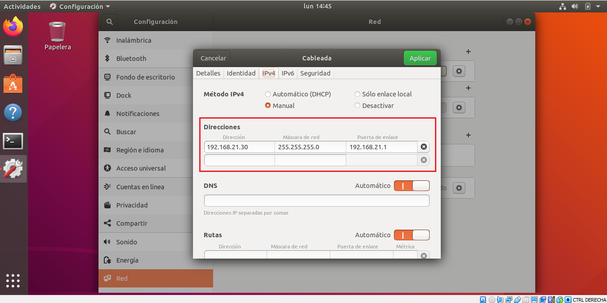
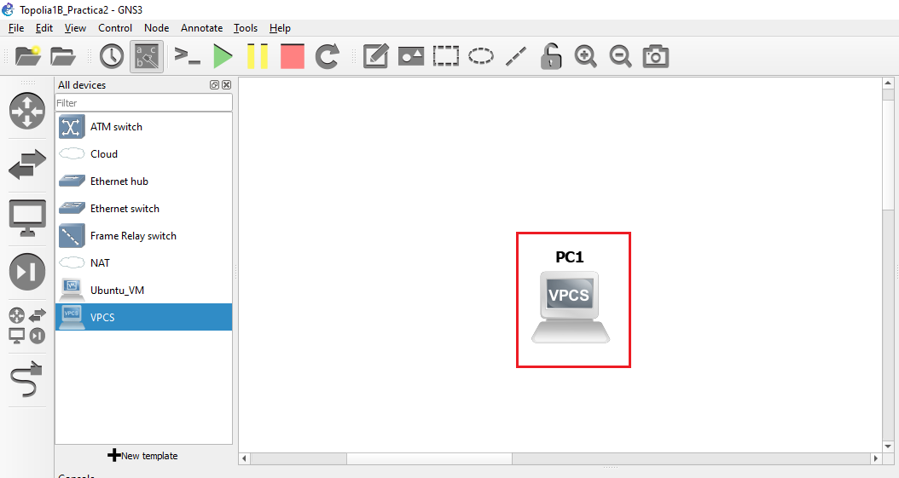
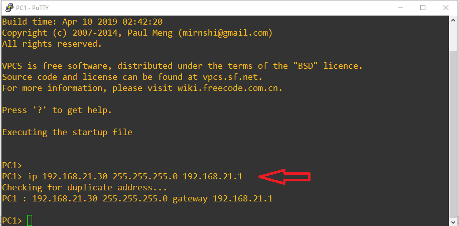
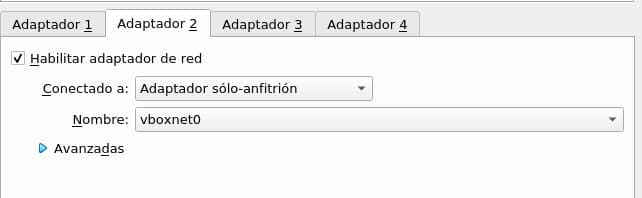

<!-- START doctoc generated TOC please keep comment here to allow auto update -->
<!-- DON'T EDIT THIS SECTION, INSTEAD RE-RUN doctoc TO UPDATE -->
**Table of Contents**  *generated with [DocToc](https://github.com/thlorenz/doctoc)*

- [Practica 2](#practica-2)
      - [Grupo 1](#grupo-1)
      - [Guatemala 31 de Agosto 2021](#guatemala-31-de-agosto-2021)
- [Tabla de Contenido](#tabla-de-contenido)
- [**1. Configuración de la máquina virtual de GNS3 para poder utilizar VirtualBox o VMWare**](#1-configuraci%C3%B3n-de-la-m%C3%A1quina-virtual-de-gns3-para-poder-utilizar-virtualbox-o-vmware)
  - [**1.1. Instalacion VirtualBox**](#11-instalacion-virtualbox)
  - [**1.2. Descarga Archivos**](#12-descarga-archivos)
  - [**1.3. Creacion Maquina Virtual Ubuntu**](#13-creacion-maquina-virtual-ubuntu)
  - [**1.4. Creacion Maquina Virtual GNS3**](#14-creacion-maquina-virtual-gns3)
  - [**1.5. Agregar Maquinas Virtuales**](#15-agregar-maquinas-virtuales)
- [**2. Configuración de las 2 topologías en GNS3**](#2-configuraci%C3%B3n-de-las-2-topolog%C3%ADas-en-gns3)
  - [**2.1. Topología 1**](#21-topolog%C3%ADa-1)
  - [**2.2. Topología 1A**](#22-topolog%C3%ADa-1a)
  - [**2.3. Topología 1B**](#23-topolog%C3%ADa-1b)
  - [**2.4. Topología 1C**](#24-topolog%C3%ADa-1c)
  - [**2.5. Topología 2**](#25-topolog%C3%ADa-2)
- [**3. Configuración de las VPCs**](#3-configuraci%C3%B3n-de-las-vpcs)
- [**4. Configuración de las máquinas virtuales**](#4-configuraci%C3%B3n-de-las-m%C3%A1quinas-virtuales)
- [**5. Instalación y configuración de los servidores web**](#5-instalaci%C3%B3n-y-configuraci%C3%B3n-de-los-servidores-web)
  - [**5.1 Configuración de de las ip de los servidores**](#51-configuraci%C3%B3n-de-de-las-ip-de-los-servidores)
    - [***5.1.1 Ip servidor informatica***](#511-ip-servidor-informatica)
    - [***5.1.2 Ip servidor ventas***](#512-ip-servidor-ventas)
    - [***5.1.3 Ip servidor contabilidad***](#513-ip-servidor-contabilidad)
  - [**5.2 Istalación de sevidor apache2**](#52-istalaci%C3%B3n-de-sevidor-apache2)
    - [***5.2.1 Actualización de paquetes linux***](#521-actualizaci%C3%B3n-de-paquetes-linux)
    - [***5.2.2 Descarga de servidor apache2***](#522-descarga-de-servidor-apache2)
  - [**5.3 Hacer sitio, este proceso fue igual en los 3 servidores**](#53-hacer-sitio-este-proceso-fue-igual-en-los-3-servidores)
    - [***5.3.1 Nos dirigimos a directorio donde apache resguarda el sitio que se va a desplegar***](#531-nos-dirigimos-a-directorio-donde-apache-resguarda-el-sitio-que-se-va-a-desplegar)
    - [***5.3.2 Abrimos el documento index.html con permiso sudo y el editor gedit***](#532-abrimos-el-documento-indexhtml-con-permiso-sudo-y-el-editor-gedit)
    - [***5.3.3 Colocamos dentro el codigo html de nuestro sitio, guardamos y cerramos***](#533-colocamos-dentro-el-codigo-html-de-nuestro-sitio-guardamos-y-cerramos)
- [**6. Pings entre los clientes y entre los servidores web de los departamentos correspondientes**](#6-pings-entre-los-clientes-y-entre-los-servidores-web-de-los-departamentos-correspondientes)
  - [**6.1 Comprobar comunicación de los servidores web a sus clientes**](#61-comprobar-comunicaci%C3%B3n-de-los-servidores-web-a-sus-clientes)
    - [***6.1.1 Comunicación servidor Informatica***](#611-comunicaci%C3%B3n-servidor-informatica)
    - [***6.1.2 Comunicación servidor ventas***](#612-comunicaci%C3%B3n-servidor-ventas)
    - [***6.1.3 Comunicación servidor contabilidad***](#613-comunicaci%C3%B3n-servidor-contabilidad)
  - [**6.2. Comprobar comunicación del Cliente_Contabilidad1**](#62-comprobar-comunicaci%C3%B3n-del-cliente_contabilidad1)
    - [***6.2.1. Ping a Cliente_Contabilidad2***](#621-ping-a-cliente_contabilidad2)
    - [***6.2.2. Ping a Cliente_Informatica1***](#622-ping-a-cliente_informatica1)
  - [**6.3. Comprobar comunicación del Cliente_Ventas2**](#63-comprobar-comunicaci%C3%B3n-del-cliente_ventas2)
    - [***6.3.1. Ping a Cliente_Contabilidad2***](#631-ping-a-cliente_contabilidad2)
    - [***6.3.2. Ping a Cliente_Ventas1***](#632-ping-a-cliente_ventas1)
    - [***6.3.3. Ping a SitioWeb_Ventas***](#633-ping-a-sitioweb_ventas)
    - [***6.3.4. Ping a SitioWeb_Contabilidad***](#634-ping-a-sitioweb_contabilidad)
  - [**6.4. Comprobar comunicación del Cliente_Contabilidad2**](#64-comprobar-comunicaci%C3%B3n-del-cliente_contabilidad2)
    - [***6.4.1. Ping a Cliente_Contabilidad1***](#641-ping-a-cliente_contabilidad1)
    - [***6.4.2. Ping a SitioWeb_Contabilidad***](#642-ping-a-sitioweb_contabilidad)
  - [**6.5. Comprobar comunicación del Cliente_Informatica1**](#65-comprobar-comunicaci%C3%B3n-del-cliente_informatica1)
    - [***6.5.1. Ping a Cliente_Contabilidad1***](#651-ping-a-cliente_contabilidad1)
    - [***6.5.2. Ping a Cliente_Informatica2***](#652-ping-a-cliente_informatica2)
    - [***6.5.3. Ping a SitioWeb_Informatica***](#653-ping-a-sitioweb_informatica)
  - [**6.6. Comprobar comunicación del Cliente de Ventas 1**](#66-comprobar-comunicaci%C3%B3n-del-cliente-de-ventas-1)
    - [***6.6.1. Ping hacia Cliente de Ventas 2***](#661-ping-hacia-cliente-de-ventas-2)
    - [***6.6.2 Ping hacia Servidor Web de Ventas***](#662-ping-hacia-servidor-web-de-ventas)
  - [**6.7. Comprobar comunicación del Cliente de Informatica 2**](#67-comprobar-comunicaci%C3%B3n-del-cliente-de-informatica-2)
  - [***6.7.1. Ping hacia Cliente de Informatica 1***](#671-ping-hacia-cliente-de-informatica-1)
  - [***6.7.2. Ping hacia Servidor Web de Informatica***](#672-ping-hacia-servidor-web-de-informatica)
- [**7. Visualización de la página web desde el Host Virtual Cliente**](#7-visualizaci%C3%B3n-de-la-p%C3%A1gina-web-desde-el-host-virtual-cliente)
  - [**7.1. Cliente_Ventas2**](#71-cliente_ventas2)
    - [***7.1.1. Visualización a sitio web del ServidorWeb_Ventas***](#711-visualizaci%C3%B3n-a-sitio-web-del-servidorweb_ventas)
    - [***7.1.2. Visualización a sitio web del ServidorWeb_Informatica***](#712-visualizaci%C3%B3n-a-sitio-web-del-servidorweb_informatica)
    - [***7.1.3. Visualización a sitio web del ServidorWeb_Contabilidad***](#713-visualizaci%C3%B3n-a-sitio-web-del-servidorweb_contabilidad)
  - [**7.2. Cliente_Contabilidad2**](#72-cliente_contabilidad2)
    - [***7.2.1. Visualización a sitio web del ServidorWeb_Contabilidad***](#721-visualizaci%C3%B3n-a-sitio-web-del-servidorweb_contabilidad)
    - [***7.2.2. Visualización a sitio web del ServidorWeb_Informatica***](#722-visualizaci%C3%B3n-a-sitio-web-del-servidorweb_informatica)
    - [***7.2.3. Visualización a sitio web del ServidorWeb_Ventas***](#723-visualizaci%C3%B3n-a-sitio-web-del-servidorweb_ventas)
  - [**7.3. Cliente Informatica 2**](#73-cliente-informatica-2)
    - [***7.3.1. Visualización a sitio web del Servidor Web de Ventas***](#731-visualizaci%C3%B3n-a-sitio-web-del-servidor-web-de-ventas)
    - [***7.3.2. Visualización a sitio web del Servidor Web de Informatica***](#732-visualizaci%C3%B3n-a-sitio-web-del-servidor-web-de-informatica)
    - [***7.3.3. Visualización a sitio web del Servidor Web de Contabilidad***](#733-visualizaci%C3%B3n-a-sitio-web-del-servidor-web-de-contabilidad)

<!-- END doctoc generated TOC please keep comment here to allow auto update -->

Universidad de San Carlos de Guatemala
 
Facultad de Ingeniería
 
Escuela de Ciencias y Sistemas
 
Redes de Computadoras 1
 
Ing. Miguel Marin de León
 
Aux. Juan Pablo García Monzón

    

<h1 align="center" style="font-size: 40px; font-weight: bold;">Practica 2</h1>

   

<h4 align="center" style="font-size: 30px; font-weight: bold;">Grupo 1</h4>

  

| Carnet | Nombre |
| :-: | :-:| 
| 201700965 | José Carlos I Alonzo Colocho |
| 201700319 | Estanley Rafael Cóbar García |
| 201709140 | Oscar Armin Crisostomo Ruiz |
| 201709309 | José Alejandro Santizo Cotto  |

  

<h4 align="center" style="font-size: 18px; font-weight: bold;">Guatemala 31 de Agosto 2021</h4>

*** 

    

*** 

<h1>Tabla de Contenido</h1>

- [**1. Configuración de la máquina virtual de GNS3 para poder utilizar VirtualBox o VMWare**](#1-configuración-de-la-máquina-virtual-de-gns3-para-poder-utilizar-virtualbox-o-vmware)
  - [**1.1. Instalacion VirtualBox**](#11-instalacion-virtualbox)
  - [**1.2. Descarga Archivos**](#12-descarga-archivos)
  - [**1.3. Creacion Maquina Virtual Ubuntu**](#13-creacion-maquina-virtual-ubuntu)
  - [**1.4. Creacion Maquina Virtual GNS3**](#14-creacion-maquina-virtual-gns3)
  - [**1.5. Agregar Maquinas Virtuales**](#15-agregar-maquinas-virtuales)
- [**2. Configuración de las 2 topologías en GNS3**](#2-configuración-de-las-2-topologías-en-gns3)
  - [**2.1. Topología 1**](#21-topología-1)
  - [**2.2. Topología 1A**](#22-topología-1a)
  - [**2.3. Topología 1B**](#23-topología-1b)
  - [**2.4. Topología 1C**](#24-topología-1c)
  - [**2.5. Topología 2**](#25-topología-2)
- [**3. Configuración de las VPCs**](#3-configuración-de-las-vpcs)
- [**4. Configuración de las máquinas virtuales**](#4-configuración-de-las-máquinas-virtuales)
- [**5. Instalación y configuración de los servidores web**](#5-instalación-y-configuración-de-los-servidores-web)
  - [**5.1 Configuración de de las ip de los servidores**](#51-configuración-de-de-las-ip-de-los-servidores)
    - [***5.1.1 Ip servidor informatica***](#511-ip-servidor-informatica)
    - [***5.1.2 Ip servidor ventas***](#512-ip-servidor-ventas)
    - [***5.1.3 Ip servidor contabilidad***](#513-ip-servidor-contabilidad)
  - [**5.2 Istalación de sevidor apache2**](#52-istalación-de-sevidor-apache2)
    - [***5.2.1 Actualización de paquetes linux***](#521-actualización-de-paquetes-linux)
    - [***5.2.2 Descarga de servidor apache2***](#522-descarga-de-servidor-apache2)
  - [**5.3 Hacer sitio, este proceso fue igual en los 3 servidores**](#53-hacer-sitio-este-proceso-fue-igual-en-los-3-servidores)
    - [***5.3.1 Nos dirigimos a directorio donde apache resguarda el sitio que se va a desplegar***](#531-nos-dirigimos-a-directorio-donde-apache-resguarda-el-sitio-que-se-va-a-desplegar)
    - [***5.3.2 Abrimos el documento index.html con permiso sudo y el editor gedit***](#532-abrimos-el-documento-indexhtml-con-permiso-sudo-y-el-editor-gedit)
    - [***5.3.3 Colocamos dentro el codigo html de nuestro sitio, guardamos y cerramos***](#533-colocamos-dentro-el-codigo-html-de-nuestro-sitio-guardamos-y-cerramos)
- [**6. Pings entre los clientes y entre los servidores web de los departamentos correspondientes**](#6-pings-entre-los-clientes-y-entre-los-servidores-web-de-los-departamentos-correspondientes)
  - [**6.1 Comprobar comunicación de los servidores web a sus clientes**](#61-comprobar-comunicación-de-los-servidores-web-a-sus-clientes)
    - [***6.1.1 Comunicación servidor Informatica***](#611-comunicación-servidor-informatica)
    - [***6.1.2 Comunicación servidor ventas***](#612-comunicación-servidor-ventas)
    - [***6.1.3 Comunicación servidor contabilidad***](#613-comunicación-servidor-contabilidad)
  - [**6.2. Comprobar comunicación del Cliente_Contabilidad1**](#62-comprobar-comunicación-del-cliente_contabilidad1)
    - [***6.2.1. Ping a Cliente_Contabilidad2***](#621-ping-a-cliente_contabilidad2)
    - [***6.2.2. Ping a Cliente_Informatica1***](#622-ping-a-cliente_informatica1)
  - [**6.3. Comprobar comunicación del Cliente_Ventas2**](#63-comprobar-comunicación-del-cliente_ventas2)
    - [***6.3.1. Ping a Cliente_Contabilidad2***](#631-ping-a-cliente_contabilidad2)
    - [***6.3.2. Ping a Cliente_Ventas1***](#632-ping-a-cliente_ventas1)
    - [***6.3.3. Ping a SitioWeb_Ventas***](#633-ping-a-sitioweb_ventas)
    - [***6.3.4. Ping a SitioWeb_Contabilidad***](#634-ping-a-sitioweb_contabilidad)
  - [**6.4. Comprobar comunicación del Cliente_Contabilidad2**](#64-comprobar-comunicación-del-cliente_contabilidad2)
    - [***6.4.1. Ping a Cliente_Contabilidad1***](#641-ping-a-cliente_contabilidad1)
    - [***6.4.2. Ping a SitioWeb_Contabilidad***](#642-ping-a-sitioweb_contabilidad)
  - [**6.5. Comprobar comunicación del Cliente_Informatica1**](#65-comprobar-comunicación-del-cliente_informatica1)
    - [***6.5.1. Ping a Cliente_Contabilidad1***](#651-ping-a-cliente_contabilidad1)
    - [***6.5.2. Ping a Cliente_Informatica2***](#652-ping-a-cliente_informatica2)
    - [***6.5.3. Ping a SitioWeb_Informatica***](#653-ping-a-sitioweb_informatica)
  - [**6.6. Comprobar comunicación del Cliente de Ventas 1**](#66-comprobar-comunicación-del-cliente-de-ventas-1)
    - [***6.6.1. Ping hacia Cliente de Ventas 2***](#661-ping-hacia-cliente-de-ventas-2)
    - [***6.6.2 Ping hacia Servidor Web de Ventas***](#662-ping-hacia-servidor-web-de-ventas)
  - [**6.7. Comprobar comunicación del Cliente de Informatica 2**](#67-comprobar-comunicación-del-cliente-de-informatica-2)
  - [***6.7.1. Ping hacia Cliente de Informatica 1***](#671-ping-hacia-cliente-de-informatica-1)
  - [***6.7.2. Ping hacia Servidor Web de Informatica***](#672-ping-hacia-servidor-web-de-informatica)
- [**7. Visualización de la página web desde el Host Virtual Cliente**](#7-visualización-de-la-página-web-desde-el-host-virtual-cliente)
  - [**7.1. Cliente_Ventas2**](#71-cliente_ventas2)
    - [***7.1.1. Visualización a sitio web del ServidorWeb_Ventas***](#711-visualización-a-sitio-web-del-servidorweb_ventas)
    - [***7.1.2. Visualización a sitio web del ServidorWeb_Informatica***](#712-visualización-a-sitio-web-del-servidorweb_informatica)
    - [***7.1.3. Visualización a sitio web del ServidorWeb_Contabilidad***](#713-visualización-a-sitio-web-del-servidorweb_contabilidad)
  - [**7.2. Cliente_Contabilidad2**](#72-cliente_contabilidad2)
    - [***7.2.1. Visualización a sitio web del ServidorWeb_Contabilidad***](#721-visualización-a-sitio-web-del-servidorweb_contabilidad)
    - [***7.2.2. Visualización a sitio web del ServidorWeb_Informatica***](#722-visualización-a-sitio-web-del-servidorweb_informatica)
    - [***7.2.3. Visualización a sitio web del ServidorWeb_Ventas***](#723-visualización-a-sitio-web-del-servidorweb_ventas)
  - [**7.3. Cliente Informatica 2**](#73-cliente-informatica-2)
    - [***7.3.1. Visualización a sitio web del Servidor Web de Ventas***](#731-visualización-a-sitio-web-del-servidor-web-de-ventas)
    - [***7.3.2. Visualización a sitio web del Servidor Web de Informatica***](#732-visualización-a-sitio-web-del-servidor-web-de-informatica)
    - [***7.3.3. Visualización a sitio web del Servidor Web de Contabilidad***](#733-visualización-a-sitio-web-del-servidor-web-de-contabilidad)

- [**1. Configuración de la máquina virtual de GNS3 para poder utilizar VirtualBox o VMWare**](#1-configuración-de-la-máquina-virtual-de-gns3-para-poder-utilizar-virtualbox-o-vmware)
  - [**1.1. Instalacion VirtualBox**](#11-instalacion-virtualbox)
  - [**1.2. Descarga Archivos**](#12-descarga-archivos)
  - [**1.3. Creacion Maquina Virtual Ubuntu**](#13-creacion-maquina-virtual-ubuntu)
  - [**1.4. Creacion Maquina Virtual GNS3**](#14-creacion-maquina-virtual-gns3)
  - [**1.5. Agregar Maquinas Virtuales**](#15-agregar-maquinas-virtuales)
- [**2. Configuración de las 2 topologías en GNS3**](#2-configuración-de-las-2-topologías-en-gns3)
  - [**2.1. Topología 1**](#21-topología-1)
  - [**2.2. Topología 1A**](#22-topología-1a)
  - [**2.3. Topología 1B**](#23-topología-1b)
  - [**2.4. Topología 1C**](#24-topología-1c)
  - [**2.5. Topología 2**](#25-topología-2)
- [**3. Configuración de las VPCs**](#3-configuración-de-las-vpcs)
- [**4. Configuración de las máquinas virtuales**](#4-configuración-de-las-máquinas-virtuales)
- [**5. Instalación y configuración de los servidores web**](#5-instalación-y-configuración-de-los-servidores-web)
  - [**5.1 Configuración de de las ip de los servidores**](#51-configuración-de-de-las-ip-de-los-servidores)
    - [***5.1.1 Ip servidor informatica***](#511-ip-servidor-informatica)
    - [***5.1.2 Ip servidor ventas***](#512-ip-servidor-ventas)
    - [***5.1.3 Ip servidor contabilidad***](#513-ip-servidor-contabilidad)
  - [**5.2 Istalación de sevidor apache2**](#52-istalación-de-sevidor-apache2)
    - [***5.2.1 Actualización de paquetes linux***](#521-actualización-de-paquetes-linux)
    - [***5.2.2 Descarga de servidor apache2***](#522-descarga-de-servidor-apache2)
  - [**5.3 Hacer sitio, este proceso fue igual en los 3 servidores**](#53-hacer-sitio-este-proceso-fue-igual-en-los-3-servidores)
    - [***5.3.1 Nos dirigimos a directorio donde apache resguarda el sitio que se va a desplegar***](#531-nos-dirigimos-a-directorio-donde-apache-resguarda-el-sitio-que-se-va-a-desplegar)
    - [***5.3.2 Abrimos el documento index.html con permiso sudo y el editor gedit***](#532-abrimos-el-documento-indexhtml-con-permiso-sudo-y-el-editor-gedit)
    - [***5.3.3 Colocamos dentro el codigo html de nuestro sitio, guardamos y cerramos***](#533-colocamos-dentro-el-codigo-html-de-nuestro-sitio-guardamos-y-cerramos)
- [**6. Pings entre los clientes y entre los servidores web de los departamentos correspondientes**](#6-pings-entre-los-clientes-y-entre-los-servidores-web-de-los-departamentos-correspondientes)
  - [**6.1 Comprobar comunicación de los servidores web a sus clientes**](#61-comprobar-comunicación-de-los-servidores-web-a-sus-clientes)
    - [***6.1.1 Comunicación servidor Informatica***](#611-comunicación-servidor-informatica)
    - [***6.1.2 Comunicación servidor ventas***](#612-comunicación-servidor-ventas)
    - [***6.1.3 Comunicación servidor contabilidad***](#613-comunicación-servidor-contabilidad)
  - [**6.2. Comprobar comunicación del Cliente_Contabilidad1**](#62-comprobar-comunicación-del-cliente_contabilidad1)
    - [***6.2.1. Ping a Cliente_Contabilidad2***](#621-ping-a-cliente_contabilidad2)
    - [***6.2.2. Ping a Cliente_Informatica1***](#622-ping-a-cliente_informatica1)
  - [**6.3. Comprobar comunicación del Cliente_Ventas2**](#63-comprobar-comunicación-del-cliente_ventas2)
    - [***6.3.1. Ping a Cliente_Contabilidad2***](#631-ping-a-cliente_contabilidad2)
    - [***6.3.2. Ping a Cliente_Ventas1***](#632-ping-a-cliente_ventas1)
    - [***6.3.3. Ping a SitioWeb_Ventas***](#633-ping-a-sitioweb_ventas)
    - [***6.3.4. Ping a SitioWeb_Contabilidad***](#634-ping-a-sitioweb_contabilidad)
  - [**6.4. Comprobar comunicación del Cliente_Contabilidad2**](#64-comprobar-comunicación-del-cliente_contabilidad2)
    - [***6.4.1. Ping a Cliente_Contabilidad1***](#641-ping-a-cliente_contabilidad1)
    - [***6.4.2. Ping a SitioWeb_Contabilidad***](#642-ping-a-sitioweb_contabilidad)
  - [**6.5. Comprobar comunicación del Cliente_Informatica1**](#65-comprobar-comunicación-del-cliente_informatica1)
    - [***6.5.1. Ping a Cliente_Contabilidad1***](#651-ping-a-cliente_contabilidad1)
    - [***6.5.2. Ping a Cliente_Informatica2***](#652-ping-a-cliente_informatica2)
    - [***6.5.3. Ping a SitioWeb_Informatica***](#653-ping-a-sitioweb_informatica)
  - [**6.6. Comprobar comunicación del Cliente de Ventas 1**](#66-comprobar-comunicación-del-cliente-de-ventas-1)
    - [***6.6.1. Ping hacia Cliente de Ventas 2***](#661-ping-hacia-cliente-de-ventas-2)
    - [***6.6.2 Ping hacia Servidor Web de Ventas***](#662-ping-hacia-servidor-web-de-ventas)
  - [**6.7. Comprobar comunicación del Cliente de Informatica 2**](#67-comprobar-comunicación-del-cliente-de-informatica-2)
  - [***6.7.1. Ping hacia Cliente de Informatica 1***](#671-ping-hacia-cliente-de-informatica-1)
  - [***6.7.2. Ping hacia Servidor Web de Informatica***](#672-ping-hacia-servidor-web-de-informatica)
- [**7. Visualización de la página web desde el Host Virtual Cliente**](#7-visualización-de-la-página-web-desde-el-host-virtual-cliente)
  - [**7.1. Cliente_Ventas2**](#71-cliente_ventas2)
    - [***7.1.1. Visualización a sitio web del ServidorWeb_Ventas***](#711-visualización-a-sitio-web-del-servidorweb_ventas)
    - [***7.1.2. Visualización a sitio web del ServidorWeb_Informatica***](#712-visualización-a-sitio-web-del-servidorweb_informatica)
    - [***7.1.3. Visualización a sitio web del ServidorWeb_Contabilidad***](#713-visualización-a-sitio-web-del-servidorweb_contabilidad)
  - [**7.2. Cliente_Contabilidad2**](#72-cliente_contabilidad2)
    - [***7.2.1. Visualización a sitio web del ServidorWeb_Contabilidad***](#721-visualización-a-sitio-web-del-servidorweb_contabilidad)
    - [***7.2.2. Visualización a sitio web del ServidorWeb_Informatica***](#722-visualización-a-sitio-web-del-servidorweb_informatica)
    - [***7.2.3. Visualización a sitio web del ServidorWeb_Ventas***](#723-visualización-a-sitio-web-del-servidorweb_ventas)
  - [**7.3. Cliente Informatica 2**](#73-cliente-informatica-2)
    - [***7.3.1. Visualización a sitio web del Servidor Web de Ventas***](#731-visualización-a-sitio-web-del-servidor-web-de-ventas)
    - [***7.3.2. Visualización a sitio web del Servidor Web de Informatica***](#732-visualización-a-sitio-web-del-servidor-web-de-informatica)
    - [***7.3.3. Visualización a sitio web del Servidor Web de Contabilidad***](#733-visualización-a-sitio-web-del-servidor-web-de-contabilidad)

    

# **1. Configuración de la máquina virtual de GNS3 para poder utilizar VirtualBox o VMWare**

***
## **1.1. Instalacion VirtualBox**
***
  1.1 Descargar el archivo de VirtualBox en el siguiente link instalado ***https://www.virtualbox.org/wiki/Downloads*** en el cual dependiendo del sistema operativo se descargara (imagen 1.1) el cual luego ejecutaremos y dejaremos la configuracion determinada. 
  - ***NOTA:*** VirtualBox es una aplicación que sirve para hacer máquinas virtuales con instalaciones de sistemas operativos. Esto quiere decir que si tienes un ordenador con Windows, GNU/Linux o incluso macOS, puedes crear una máquina virtual con cualquier otro sistema operativo para utilizarlo dentro del que estés usando.

 

Imagen 1.1. Descarga de VirtualBox

  

***
## **1.2. Descarga Archivos**
***
  1.2.1. Descargaremos una imagen ISO de ubuntu en el cual en esta practica descargaremos el 18.04.5  ***https://releases.ubuntu.com/18.04.5/***  (imagen 1.2.1) la cual utilizaremos luego para crear la maquina virtual.
  - ***NOTA:*** Una imagen ISO es una de las mejores formas de poder hacer una réplica exacta de un DVD, CD o Blu-Ray para mantener seguro el original, pero además ofrece otras ventajas como la posibilidad de ejecutar juegos y aplicaciones sin la complicación de tener que insertar el medio físico en la computadora, lo que también nos genera una mejor performance.

 

Imagen 1.2.1. Descarga de Imagen ISO

 

1.2.2. Descargaremos el archivo  de la maquina virtual de GNS3 luego ser importada desde el siguiente link  ***https://www.gns3.com/software/download-vm***  (imagen 1.2.2).

 

Imagen 1.2. Descarga de Imagen ISO

  

***
## **1.3. Creacion Maquina Virtual Ubuntu**
***

  1.3.1 Abrir el programa Oracle VM VirtualBox en la cual seleccionaremos la opcion de crear una nueva (imagen 1.3.1).

 

Imagen 1.3.1. Nueva Maquina Virtual

 

  1.3.2. Se desplegara opciones de cual le pondremos el nombre que deseenos que tenga nuestra maquina virtual, así mismo el tipo de distrubucion que en este caso utilizaremos linux y ubuntu con base 64 como se muestra en la imagen 1.3.2.
  

Imagen 1.3.2. Nombre y tipo de distribucion 

 

  1.3.3. Seleccionaremos el tamño de la memoria ram que deseemos la cual lo recomendable es de 1024 MB (imagen 1.3.3.)
  

Imagen 1.3.3. Tamaño de ram

 

  1.3.4. Seleccionemos el tipo de disco duro que necesitamos para nuestra maquina virtual la cual al ser la primera se recomienda crear un disco duro virtual (imagen 1.3.4).
  

Imagen 1.3.4. Tipo de disco duro

 

  1.3.5 Al seleccionar el tipo de archivo de disco duro virtual nuevo seleccionaremos la opcion VDI la cual es la opcion ideal para esta practica (imagen 1.3.5.)
  

Imagen 1.3.5. Tipo de archivo de disco

 

  1.3.6 Seleccionar reserva dinamica para el almacenamiento en unidad de disco duro fisica (imagen 1.3.6.)
  

Imagen 1.3.6. Almacenamiento en unidad fisica

 

  1.3.7. Se debe seleccionar la imagen ISO previamente descargada (imagen 3.5.)
  

Imagen 1.3.7. Seleccion imagen ISO

  

***
## **1.4. Creacion Maquina Virtual GNS3**
***
1.4.1. Seleccionar la opcion de importar un servicio virtualizado lo cual es la maquina virtual de GNS3 (Imagen 1.4.1).
  - ***NOTA:*** La virtualización es una tecnología que permite crear servicios de TI útiles mediante recursos que están ligados tradicionalmente al hardware. Además, distribuye sus funcionalidades entre diversos usuarios o entornos, lo que permite utilizar toda la capacidad de una máquina física.

  

Imagen 1.4.1. Importar servicio virtualizado

 

1.4.2. Seleccionar el archivo de la maquina virtual de GNS3 previamente descargada para luego darle a la opcion next para continuar con las siguientes configuraciones (Imagen 1.4.2) .

  

Imagen 1.4.2. Servicio a importar

 

1.4.3. Importaremos la maquina virtual con las configuraciones y preferencias predeterminadas para el correcto uso (Imagen 1.4.3).

  

Imagen 1.4.3. Preferencias de servicio 

 

***
## **1.5. Agregar Maquinas Virtuales**
***
1.5.1. En GNS3 seleccionaremos Edit para luego seleccionar Preference (Imagen 1.5.1) .

  

Imagen 1.5.1. Opciones preference

 

1.5.2.seleccionar opcion VirtualBox(VirtualBox VM) para luego añadir en la opcion New (Imagen 1.5.2) .

  

Imagen 1.5.2. Opciones añadir

 

1.5.3.Seleccionar las maquinas virtuales que creamos anteriormente que aparecera en la VM List luego con  (Imagen 1.5.3) .

  

Imagen 1.5.3. Seleccion MV

 

1.5.4. En All Divice ya aparecera las maquinas agregadas anteriormente en la cual la podemos iniciar como se muestra en la siguiente imagen (Imagen 1.5.4) .

  

Imagen 1.5.4. Maquinas virtuales 

 

  

***
# **2. Configuración de las 2 topologías en GNS3**

***
## **2.1. Topología 1**
***

2.1.1. Configuraciones de las VLANs en el switch 2. (Imagen 2.1.1) 
  

***Modo Truncal*** => Switch - Switch (Topologia 1A)
* Port = 0
* VLAN = 1
 

***Modo acceso*** =>  Switch - Switch (Topologia 2) 
* Port = 1
* VLAN = 1

***Modo Truncal*** =>  Switch - Nube (Topologia 1B)
* Port = 2
* VLAN = 1

 

Imagen 2.1.1. Configuración VLANs Switch 2

 

2.1.2. Configuraciones de las VLANs en el switch 3. (Imagen 2.1.2) 
  

***Modo Truncal*** =>  Switch - Switch (Topologia 2)
* Port = 0
* VLAN = 1
  

***Modo Truncal*** => Switch - Nube (Topologia 1C)
* Port = 1
* VLAN = 1

 

Imagen 2.1.2. Configuración VLANs Switch 3

 

2.1.3. Configuraciones de las VLANs en el switch 4. (Imagen 2.1.3) 
  

***Modo Truncal*** =>  Switch - Switch (Topologia 1B)
* Port = 0
* VLAN = 1
  

***Modo Truncal*** => Switch - Switch (Topologia 1C)
* Port = 1
* VLAN = 1
 

***Modo Truncal*** => Switch - Nube (Topologia 2)
* Port = 2
* VLAN = 1
 

 

Imagen 2.1.3. Configuración VLANs Switch 4

 

2.1.4. Configuración UDP de la nube 1 hacia la topologia 1B. (Imagen 2.1.4)
* Name = UDP tunnel1
* Local port = 20300
* Remote host = 10.8.0.3
* Remote port = 30300

 

Imagen 2.1.4. Configuración UDP nube 1

 

2.1.5. Configuración UDP de la nube 3 hacia la topologia 1C. (Imagen 2.1.5)
* Name = UDP tunnel1
* Local port = 20200
* Remote host = 10.8.0.5
* Remote port = 30200

 

Imagen 2.1.5. Configuración UDP nube 3

 

2.1.6. Configuración UDP de la nube 2 hacia la topologia 2. (Imagen 2.1.6)
* Name = UDP tunnel1
* Local port = 20100
* Remote host = 10.8.0.4
* Remote port = 30100

 

Imagen 2.1.6. Configuración UDP nube 2

 

2.1.7. Topología 1 que cuenta con tres nubes conectadas hacia la *topologia 1A, 1B y 2*, y tres switch que conectan las nubes de las *topologias 1B, 1C y 2* con la *topologia local 1A*. (Imagen 2.1.7)

 

Imagen 2.1.7. Topología 1

  

***
## **2.2. Topología 1A**
***

2.2.1. Configuración IP en la máquina VPC:
***Cliente_Ventas1*** con las siguientes configuraciones: (Imagen 2.2.1)

 

* Direccion IP = 192.168.21.15
* Mascara de subred = 255.255.255.0 
* Puerta de enlace = 192.168.21.1

  

Imagen 2.2.1. Configuración Cliente_Ventas1

 

2.2.2. Configuración IP en la máquina virtual:
***Cliente_Informatica2*** con las siguientes configuraciones: (Imagen 2.2.2)

 

* Direccion IP = 192.168.11.30
* Mascara de subred = 255.255.255.0 
* Puerta de enlace = 192.168.11.1

  

Imagen 2.2.2. Configuración Cliente_Informatica2

 

2.2.3. Configuraciones de las VLANs en el switch. (Imagen 2.2.3) 
  

***Modo acceso*** =>  Switch - Cliente_Ventas1
* Port = 0
* VLAN = 20
  

***Modo Truncal*** => Switch - Topologia 1
* Port = 1
* VLAN = 1
 

***Modo acceso*** =>  Switch - Cliente_Informatica2 
* Port = 2
* VLAN = 10

 

Imagen 2.2.3. Configuración VLANs Switch

 

2.2.4. Topología 1A que cuenta con una VPC (Cliente_Ventas1), una Máquina Virtual (CLiente_Informatica2) y un Switch (Imagen 2.2.4)

 

Imagen 2.2.4. Topología 1A

  

***
## **2.3. Topología 1B**
***

2.3.1. Configuración IP en máquina VPC: ***Cliente_Contabilidad1*** con las siguientes configuraciones: (Imagen 2.3.1)

* DireccionIP = 192.168.31.15
* MáscaraDeSubRed = 255.255.255.0
* PuertaDeEnlace = 192.168.31.1

 

Imagen 2.3.1. Configuración Cliente_Contabilidad1

 

2.3.2. Configuración IP en máquina virtual: ***Cliente_Ventas2*** con las siguientes configuraciones: (Imagen 2.3.2)

* DireccionIP = 192.168.21.30
* MáscaraDeSubRed = 255.255.255.0
* PuertaDeEnlace = 192.168.21.1

 

Imagen 2.3.2. Configuración Cliente_Ventas2

 

2.3.3. Configuraciones de las VLANs en el switch. (Imagen 2.3.3) 
  

***Modo Truncal*** = Switch - nube (Topología1B)
* Port = 0
* VLAN = 1
 

***Modo acceso*** =  Switch - Cliente_Contabilidad1 
* Port = 1
* VLAN = 30
   

***Modo acceso*** =  Switch - Cliente_Ventas2
* Port = 2
* VLAN = 20
  

 

Imagen 2.3.3. Configuración VLANs Switch

 

2.3.4. Configuración UDP de la nube. (Imagen 2.3.4)
* Name = UDP tunnel1
* Local port = 30300
* Remote host = 10.8.0.2
* Remote port = 20300

 

Imagen 2.3.4. Configuración UDP nube

 

2.3.5. Topología 1B que cuenta con una VPC (Cliente_Contabilidad1), una Máquina Virtual (CLiente_Ventas2), un Switch y una nube. (Imagen 2.3.5)

 

Imagen 2.3.5. Topología 1B

  

***
## **2.4. Topología 1C**
***

2.4.1. Configuración IP en máquina VPC: ***Cliente_Informatica1*** con las siguientes configuraciones: (Imagen 2.4.1)

* DireccionIP = 192.168.11.15
* MáscaraDeSubRed = 255.255.255.0
* PuertaDeEnlace = 192.168.11.1

 

Imagen 2.4.1. Configuración Cliente_Informatica1

 

2.4.2. Configuración IP en máquina virtual: ***Cliente_Contabilidad2*** con las siguientes configuraciones: (Imagen 2.4.2)

* DireccionIP = 192.168.31.30
* MáscaraDeSubRed = 255.255.255.0
* PuertaDeEnlace = 192.168.31.1

 

Imagen 2.3.2. Configuración Cliente_Contabilidad2

 

2.4.3. Configuraciones de las VLANs en el switch. (Imagen 2.4.3) 
  

***Modo Truncal*** = Switch - nube (Topología1C)
* Port = 2
* VLAN = 1
 

***Modo acceso*** =  Switch - Cliente_Informatica1 
* Port = 0
* VLAN = 10
   

***Modo acceso*** =  Switch - Cliente_Contabilidad2
* Port = 1
* VLAN = 30
  

 

Imagen 2.4.3. Configuración VLANs Switch

 

2.4.4. Configuración UDP de la nube. (Imagen 2.4.4)
* Name = UDP tunnel1
* Local port = 30200
* Remote host = 10.8.0.2
* Remote port = 20200

 

Imagen 2.4.4. Configuración UDP nube

 

2.4.5. Topología 1C que cuenta con una VPC (Cliente_Informatica1), una Máquina Virtual (CLiente_Contabilidad2), un Switch y una nube. (Imagen 2.4.5)

 

Imagen 2.4.5. Topología 1C

  

***
## **2.5. Topología 2**

 

2.5.1 Topología 2 en GNS3

 

 

2.5.2 Topología 2 configuracion de VLANS en Switch

 

 

***
# **3. Configuración de las VPCs**

3.1. Seleccionar el dispositivo ***VPC*** de la barra lateral izquierda (Imagen 3.1) y agregar a nuestro espacio de trabajo (Imagen 3.2).

 

Imagen 3.1. Seleccionar VPC

 

Imagen 3.2. Agregar VPC a Espacio de trabajo

 

3.2. Encender la VPC haciendo clic derecho en la VPC y luego hacer clic en ***Start*** (Imagen 3.3).

 

Imagen 3.3. Encender VPC

 

3.3. Ingresar a la consola de la VPC, realizando clic derecho en la VPC y luego hacer clic en Console (Imagen 3.4), automaticamente se debe abrir la consola de la VPC (Imagen 3.5).

 

Imagen 3.4. Abrir Consola VPC

 

Imagen 3.5. Consola VPC

 

3.4. Configurar el ip de la VPC ingresando el siguiente comando en consola.
 

>***ip DireccionIP MáscaraDeSubRed PuertaDeEnlace***.
 

> Por ejemplo: para el departamento de Ventas2 sería = *ip 192.168.21.30 255.255.255.0 192.168.21.1*
 
Luego de haber ingresado el comando, presionar la tecla enter (Imagen 3.6)

  

Imagen 3.6. Comando ip

 

> ***NOTA:***
>  Cada VPC fue creada con los siguientes comandos:> 
>  VPC1 = Cliente_Informatica1 = ip 192.168.11.15 255.255.255.0 192.168.11.1 
>  VPC2 = Cliente_Ventas1 = ip 192.168.21.15 255.255.255.0 192.168.21.1 
>  VPC3 = Cliente_Contabilidad1 = ip 192.168.31.15 255.255.255.0 192.168.31.1
  

3.5. Verificar la configuración de la IP en la VPC con el comando = ***sh*** ,(Imagen 3.7.) Con este comando se desplagara la información de la ip de la vpc.

 

Imagen 3.7. Comando sh

 

3.6. Guardar cambios realizados a la VPC con el comando = ***save***  (Imagen 3.8), se debe mostrar un mensaje donde guarda todos los cambios realizados.

 

Imagen 3.8. Comando save

  

*** 
# **4. Configuración de las máquinas virtuales**

Iniciaremos por crear nuestra maquina virtual en Virtual box (Imagen 4.1).

 

Imagen 4.1. Instancia de maquina virtual

 

Luego de tenerla creada nos iremos hacia la configuracion de la misma. (Imagen 4.2).

 

Imagen 4.2. Configuraciones maquina virtual

 

Nos dirigimos hacia el apartado de red y habilitaremos dos adaptadores, el primero como *adaptador NAT* y el segundo como *adaptador solo-anfitrion* (Imagen 4.3 e Imagen 4.4)

 

Imagen 4.3. Adaptador de red 1

 

Imagen 4.4. Adaptador de red 2

 

Ahora iniciaremos nuestra maquina virtual e iremos al apartado de configuraciones (Imagen 4.5)

 

Imagen 4.5. Apartado de configuraciones maquina virtual

 

Ya adentro de este apartado buscaremos la sección de *red* y seleccionaremos el segundo adaptador de arriba hacia abajo (Imagen 4.6)

 

Imagen 4.6. Apartado de red de la maquina virtual

 

Ya seleccionado el adaptador nos desplegara el siguiente menu (Imagen 4.7)

 

Imagen 4.7. Menu adaptador

 

Nos dirigiremos a la parte de IPv4, seleccionaremos la opción de *Manual* y le asginaremos la IP segun sea el caso y aplicaremos los cambios(Imagen 4.8)

 

Imagen 4.8. Configuracion de la IPv4

 

Ahora podemos lanzar el comando *ifconfig* en la terminal de Ubuntu y verificar que efectvamente la ip que hayamos ingresado este ingresada en el sistema (Imagen 4.9)

 

Imagen 4.9. Comprobacion de la IP

  

***
# **5. Instalación y configuración de los servidores web**

***
## **5.1 Configuración de de las ip de los servidores**

***
### ***5.1.1 Ip servidor informatica***

***
### ***5.1.2 Ip servidor ventas***

***
### ***5.1.3 Ip servidor contabilidad***

***
## **5.2 Istalación de sevidor apache2**

***
### ***5.2.1 Actualización de paquetes linux***

***
### ***5.2.2 Descarga de servidor apache2***

***
## **5.3 Hacer sitio, este proceso fue igual en los 3 servidores**

***
### ***5.3.1 Nos dirigimos a directorio donde apache resguarda el sitio que se va a desplegar***

***
### ***5.3.2 Abrimos el documento index.html con permiso sudo y el editor gedit***

***
### ***5.3.3 Colocamos dentro el codigo html de nuestro sitio, guardamos y cerramos***

 

***
# **6. Pings entre los clientes y entre los servidores web de los departamentos correspondientes**

***
## **6.1 Comprobar comunicación de los servidores web a sus clientes**

***
### ***6.1.1 Comunicación servidor Informatica***

***
### ***6.1.2 Comunicación servidor ventas***

***
### ***6.1.3 Comunicación servidor contabilidad***

  

***
## **6.2. Comprobar comunicación del Cliente_Contabilidad1**
***

### ***6.2.1. Ping a Cliente_Contabilidad2***

 

Imagen 6.2.1. Cliente_Contabilidad1 y Cliente_Contabilidad2

 

### ***6.2.2. Ping a Cliente_Informatica1***

 

Imagen 6.2.2. Cliente_Contabilidad1 y Cliente_Informatica1

 

  

***
## **6.3. Comprobar comunicación del Cliente_Ventas2**
***

 

### ***6.3.1. Ping a Cliente_Contabilidad2***

 

Imagen 6.3.1. Cliente_Ventas2 y Cliente_Contabilidad2

 

### ***6.3.2. Ping a Cliente_Ventas1***

 

Imagen 6.3.2. Cliente_Ventas2 y Cliente_Ventas1

 

### ***6.3.3. Ping a SitioWeb_Ventas***

 

Imagen 6.3.3. Cliente_Ventas2 y SitioWeb_Ventas

 

### ***6.3.4. Ping a SitioWeb_Contabilidad***

 

Imagen 6.3.4. Cliente_Ventas2 y SitioWeb_Contabilidad

  

***
## **6.4. Comprobar comunicación del Cliente_Contabilidad2**
***

 

### ***6.4.1. Ping a Cliente_Contabilidad1***

 

Imagen 6.4.1. Cliente_Contabilidad2 y Cliente_Contabilidad1

 

### ***6.4.2. Ping a SitioWeb_Contabilidad***

 

Imagen 6.4.2. Cliente_Contabilidad2 y SitioWeb_Contabilidad

 

***
## **6.5. Comprobar comunicación del Cliente_Informatica1**
***

 

### ***6.5.1. Ping a Cliente_Contabilidad1***

 

Imagen 6.5.1. Cliente_Informatica1 y Cliente_Contabilidad1

 

 

### ***6.5.2. Ping a Cliente_Informatica2***

 

Imagen 6.5.2. Cliente_Informatica1 y Cliente_Informatica2

 

### ***6.5.3. Ping a SitioWeb_Informatica***

 

Imagen 6.5.3. Cliente_Informatica1 y SitioWeb_Informatica

 
 

***
  ## **6.6. Comprobar comunicación del Cliente de Ventas 1**
***

### ***6.6.1. Ping hacia Cliente de Ventas 2***

 

Imagen 6.6.1. Cliente_Ventas1 y Cliente_Ventas2

 

### ***6.6.2 Ping hacia Servidor Web de Ventas***

 

Imagen 6.6.2. Cliente_Ventas1 y Server_Ventas

  

***
## **6.7. Comprobar comunicación del Cliente de Informatica 2**
***

## ***6.7.1. Ping hacia Cliente de Informatica 1***

 

Imagen 6.7.1. Cliente_Informatica2 y Cliente_Informatica1

 

## ***6.7.2. Ping hacia Servidor Web de Informatica***

 

Imagen 6.7.2. Cliente_Informatica2 y Server_Informatica

  

***
# **7. Visualización de la página web desde el Host Virtual Cliente**

***
## **7.1. Cliente_Ventas2**
***

### ***7.1.1. Visualización a sitio web del ServidorWeb_Ventas***

 

Imagen 7.1.1. Cliente_Ventas2 a Web ServidorVentas

 

### ***7.1.2. Visualización a sitio web del ServidorWeb_Informatica***

 

Imagen 7.1.2. Cliente_Ventas2 a Web ServidorInformatica

 

### ***7.1.3. Visualización a sitio web del ServidorWeb_Contabilidad***

 

Imagen 7.1.3. Cliente_Ventas2 a Web ServidorContabilidad

  

***
## **7.2. Cliente_Contabilidad2**
***

### ***7.2.1. Visualización a sitio web del ServidorWeb_Contabilidad***

 

Imagen 7.2.1. Cliente_Contabilidad2 a Web ServidorContabilidad

 

### ***7.2.2. Visualización a sitio web del ServidorWeb_Informatica***

 

Imagen 7.2.2. Cliente_Contabilidad2 a Web ServidorInformatica

 

### ***7.2.3. Visualización a sitio web del ServidorWeb_Ventas***

 

Imagen 7.2.3. Cliente_Contabilidad2 a Web ServidorVentas

  

***
  ## **7.3. Cliente Informatica 2**
***
  ### ***7.3.1. Visualización a sitio web del Servidor Web de Ventas***

   

Imagen 7.3.1. Cliente_Informatica2 a ServidorWeb_Ventas 

 

  ### ***7.3.2. Visualización a sitio web del Servidor Web de Informatica***

   

Imagen 7.3.2. Cliente_Informatica2 a ServidorWeb_Informatica 

 

### ***7.3.3. Visualización a sitio web del Servidor Web de Contabilidad***

 

Imagen 7.3.3. Cliente_Informatica2 a ServidorWeb_Contabilidad 

 