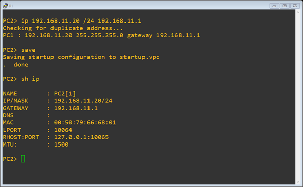
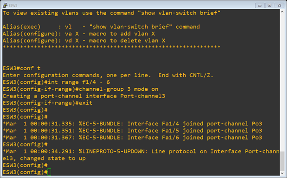
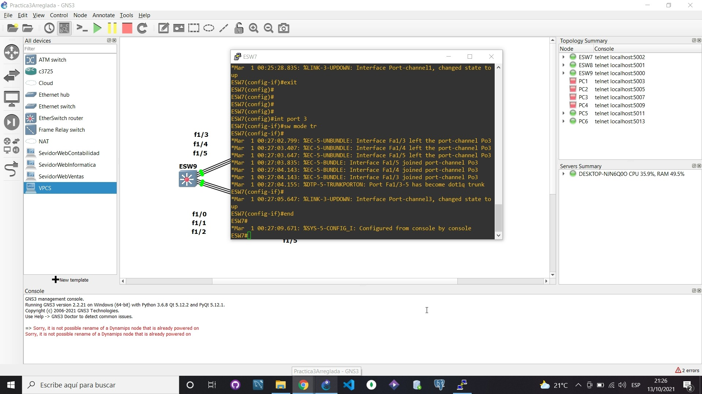
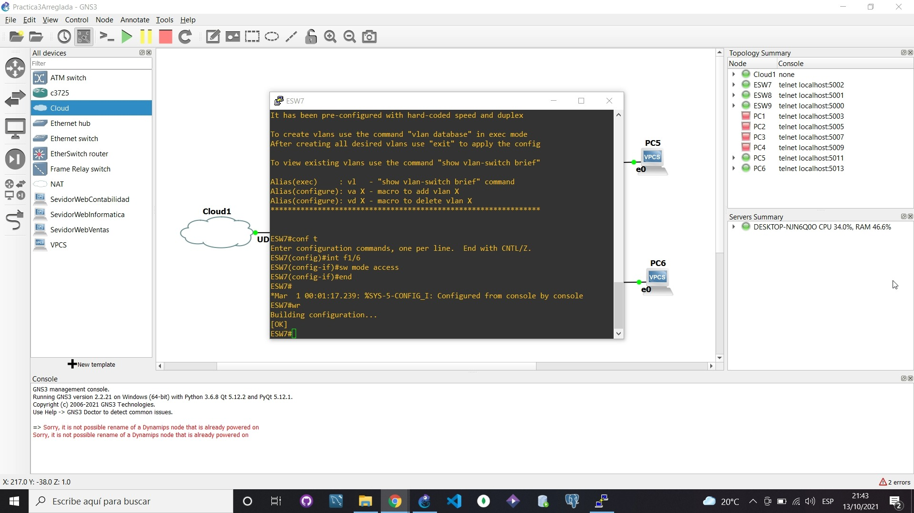
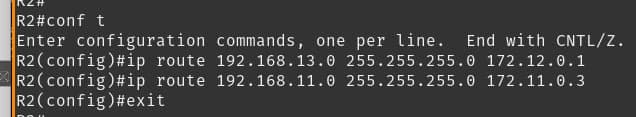
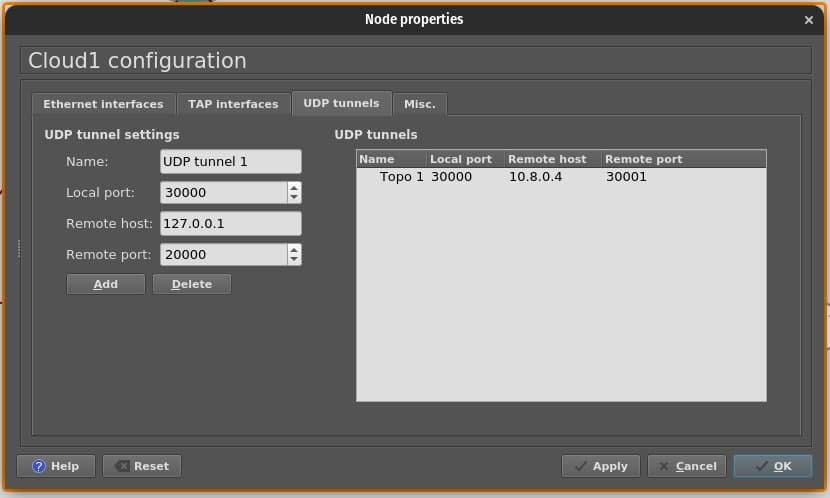

<p style="font-size: 18px">
Universidad de San Carlos de Guatemala
<br>
Facultad de Ingeniería
<br>
Escuela de Ciencias y Sistemas
<br>
Redes de Computadoras 1
<br>
Ing. Miguel Marin de León
<br>
Aux. Juan Pablo García Monzón
</p>

<br><br><br><br>


<h1 align="center" style="font-size: 40px; font-weight: bold;">Practica 3</h1>

<br><br><br>

<h4 align="center" style="font-size: 30px; font-weight: bold;">Grupo 1</h4>

<br><br>


<div align="center">

| Carnet | Nombre |
| :-: | :-:| 
| 201700965 | José Carlos I Alonzo Colocho |
| 201700319 | Estanley Rafael Cóbar García |
| 201709140 | Oscar Armin Crisostomo Ruiz |
| 201709309 | José Alejandro Santizo Cotto  |

</div>

<br><br>

<h4 align="center" style="font-size: 18px; font-weight: bold;">Guatemala 15 de Octubre 2021</h4>


*** 

<br><br><br><br>

*** 
<h1>Tabla de Contenido</h1>


<!-- START doctoc generated TOC please keep comment here to allow auto update -->
<!-- DON'T EDIT THIS SECTION, INSTEAD RE-RUN doctoc TO UPDATE -->
- [**1. Configuración topologia 1**](#1-configuraci%C3%B3n-topologia-1)

- [**1. Configuración topologia 1**](#1-configuraci%C3%B3n-topologia-1)
  - [**1.1 Configuración de VPCS**](#11-configuraci%C3%B3n-de-vpcs)
    - [**1.1.1. Asignación de Dirección IP en PC1**](#111-asignaci%C3%B3n-de-direcci%C3%B3n-ip-en-pc1)
    - [**1.1.2. Asignación de Dirección IP en PC2**](#112-asignaci%C3%B3n-de-direcci%C3%B3n-ip-en-pc2)
  - [**1.2. Configuración de Etherchannel:**](#12-configuraci%C3%B3n-de-etherchannel)
    - [**1.2.1. ESW1:**](#121-esw1)
      - [**1.2.1.1. Etherchannel2:**](#1211-etherchannel2)
      - [**1.2.1.2. Etherchannel3:**](#1212-etherchannel3)
      - [**1.2.1.3. Ver configuración realizada y guardar cambios:**](#1213-ver-configuraci%C3%B3n-realizada-y-guardar-cambios)
    - [**1.2.2. ESW2:**](#122-esw2)
      - [**1.2.2.1. Etherchannel2:**](#1221-etherchannel2)
      - [**1.2.2.2. Etherchannel1:**](#1222-etherchannel1)
      - [**1.2.2.3. Ver configuración realizada y guardar cambios:**](#1223-ver-configuraci%C3%B3n-realizada-y-guardar-cambios)
    - [**1.2.3. ESW3:**](#123-esw3)
      - [**1.2.3.1. Etherchannel3:**](#1231-etherchannel3)
      - [**1.2.3.2. Etherchannel1:**](#1232-etherchannel1)
      - [**1.2.3.3. Ver configuración realizada y guardar cambios:**](#1233-ver-configuraci%C3%B3n-realizada-y-guardar-cambios)
  - [**1.3. Configuración de Enlace Truncal de Etherchannel:**](#13-configuraci%C3%B3n-de-enlace-truncal-de-etherchannel)
    - [**1.3.1. ESW1:**](#131-esw1)
      - [**1.3.1.1. Port2:**](#1311-port2)
      - [**1.3.1.2. Port3:**](#1312-port3)
      - [**1.3.1.3. Ver configuración realizada y guardar cambios:**](#1313-ver-configuraci%C3%B3n-realizada-y-guardar-cambios)
    - [**1.3.2. ESW2:**](#132-esw2)
      - [**1.3.2.1. Port1:**](#1321-port1)
      - [**1.3.2.2. Port2:**](#1322-port2)
      - [**1.3.2.3. Ver configuración realizada y guardar cambios:**](#1323-ver-configuraci%C3%B3n-realizada-y-guardar-cambios)
    - [**1.3.3. ESW3:**](#133-esw3)
      - [**1.3.3.1. Port1:**](#1331-port1)
      - [**1.3.2.2. Port3:**](#1322-port3)
      - [**1.3.3.3. Ver configuración realizada y guardar cambios:**](#1333-ver-configuraci%C3%B3n-realizada-y-guardar-cambios)
  - [**1.4. Configuración de Enlace de Acceso de Red:**](#14-configuraci%C3%B3n-de-enlace-de-acceso-de-red)
    - [**1.4.1. ESW1:**](#141-esw1)
    - [**1.4.2. ESW2:**](#142-esw2)
    - [**1.4.3. ESW3:**](#143-esw3)
  - [**1.5. Estados de las interfaces**](#15-estados-de-las-interfaces)
    - [**1.5.1. ESW1:**](#151-esw1)
    - [**1.5.2. ESW2:**](#152-esw2)
    - [**1.5.3. ESW3:**](#153-esw3)
  - [**1.6. Configuración de nube:**](#16-configuraci%C3%B3n-de-nube)
- [**2. Configuración topologia 2**](#2-configuraci%C3%B3n-topologia-2)
  - [**2.1 Configuración de VPCS**](#21-configuraci%C3%B3n-de-vpcs)
    - [**2.1.1. Asignación de Dirección IP en PC7**](#211-asignaci%C3%B3n-de-direcci%C3%B3n-ip-en-pc7)
    - [**2.1.2. Asignación de Dirección IP en PC8**](#212-asignaci%C3%B3n-de-direcci%C3%B3n-ip-en-pc8)
  - [**2.2. Configuración de Etherchannel:**](#22-configuraci%C3%B3n-de-etherchannel)
    - [**2.2.1. ESW4:**](#221-esw4)
      - [**2.2.1.1. Etherchannel3:**](#2211-etherchannel3)
      - [**2.2.1.2. Etherchannel2:**](#2212-etherchannel2)
      - [**2.2.1.3. Ver configuración realizada y guardar cambios:**](#2213-ver-configuraci%C3%B3n-realizada-y-guardar-cambios)
    - [**2.2.2. ESW5:**](#222-esw5)
      - [**2.2.2.1. Etherchannel1:**](#2221-etherchannel1)
      - [**2.2.2.2. Etherchannel2:**](#2222-etherchannel2)
      - [**2.2.2.3. Ver configuración realizada y guardar cambios:**](#2223-ver-configuraci%C3%B3n-realizada-y-guardar-cambios)
    - [**2.2.3. ESW6:**](#223-esw6)
      - [**2.2.3.1. Etherchannel1:**](#2231-etherchannel1)
      - [**2.2.3.2. Etherchannel3:**](#2232-etherchannel3)
      - [**2.2.3.3. Ver configuración realizada y guardar cambios:**](#2233-ver-configuraci%C3%B3n-realizada-y-guardar-cambios)
  - [**2.3. Configuración de Enlace Truncal de Etherchannel:**](#23-configuraci%C3%B3n-de-enlace-truncal-de-etherchannel)
    - [**2.3.1. ESW4:**](#231-esw4)
      - [**2.3.1.1. Port2:**](#2311-port2)
      - [**2.3.1.2. Port3:**](#2312-port3)
      - [**2.3.1.3. Ver configuración realizada y guardar cambios:**](#2313-ver-configuraci%C3%B3n-realizada-y-guardar-cambios)
    - [**2.3.2. ESW5:**](#232-esw5)
      - [**2.3.2.1. Port1:**](#2321-port1)
      - [**2.3.2.2. Port2:**](#2322-port2)
      - [**2.3.2.3. Ver configuración realizada y guardar cambios:**](#2323-ver-configuraci%C3%B3n-realizada-y-guardar-cambios)
    - [**2.3.3. ESW6:**](#233-esw6)
      - [**2.3.3.1. Port1:**](#2331-port1)
      - [**1.3.2.2. Port3:**](#1322-port3-1)
      - [**2.3.3.3. Ver configuración realizada y guardar cambios:**](#2333-ver-configuraci%C3%B3n-realizada-y-guardar-cambios)
  - [**2.4. Configuración de Enlace de Acceso de Red:**](#24-configuraci%C3%B3n-de-enlace-de-acceso-de-red)
    - [**2.4.1. ESW4:**](#241-esw4)
    - [**2.4.2. ESW5:**](#242-esw5)
    - [**2.4.3. ESW6:**](#243-esw6)
  - [**2.5. Estados de las interfaces**](#25-estados-de-las-interfaces)
    - [**2.5.1. ESW1:**](#251-esw1)
    - [**2.5.2. ESW5:**](#252-esw5)
    - [**2.5.3. ESW6:**](#253-esw6)
  - [**2.6. Configuración de nube:**](#26-configuraci%C3%B3n-de-nube)
- [**3. Configuración topologia 3**](#3-configuraci%C3%B3n-topologia-3)
  - [**3.1 Configuración de VPCS**](#31-configuraci%C3%B3n-de-vpcs)
    - [**3.1.1. Asignación de Dirección IP en PC1**](#311-asignaci%C3%B3n-de-direcci%C3%B3n-ip-en-pc1)
    - [**3.1.2. Asignación de Dirección IP en PC2**](#312-asignaci%C3%B3n-de-direcci%C3%B3n-ip-en-pc2)
  - [**3.2. Configuración de Etherchannel:**](#32-configuraci%C3%B3n-de-etherchannel)
    - [**3.2.1. ESW1:**](#321-esw1)
      - [**3.2.1.1. Etherchannel2:**](#3211-etherchannel2)
      - [**3.2.1.2. Etherchannel3:**](#3212-etherchannel3)
      - [**3.2.1.3. Ver configuración realizada y guardar cambios:**](#3213-ver-configuraci%C3%B3n-realizada-y-guardar-cambios)
    - [**3.2.2. ESW2:**](#322-esw2)
      - [**3.2.2.1. Etherchannel2:**](#3221-etherchannel2)
      - [**3.2.2.2. Etherchannel1:**](#3222-etherchannel1)
      - [**3.2.2.3. Ver configuración realizada y guardar cambios:**](#3223-ver-configuraci%C3%B3n-realizada-y-guardar-cambios)
    - [**3.2.3. ESW3:**](#323-esw3)
      - [**3.2.3.1. Etherchannel3:**](#3231-etherchannel3)
      - [**3.2.3.2. Etherchannel1:**](#3232-etherchannel1)
      - [**3.2.3.3. Ver configuración realizada y guardar cambios:**](#3233-ver-configuraci%C3%B3n-realizada-y-guardar-cambios)
  - [**3.3. Configuración de Enlace Truncal de Etherchannel:**](#33-configuraci%C3%B3n-de-enlace-truncal-de-etherchannel)
    - [**3.3.1. ESW1:**](#331-esw1)
      - [**3.3.1.1. Port2:**](#3311-port2)
      - [**3.3.1.2. Port3:**](#3312-port3)
      - [**3.3.1.3. Ver configuración realizada y guardar cambios:**](#3313-ver-configuraci%C3%B3n-realizada-y-guardar-cambios)
    - [**3.3.2. ESW2:**](#332-esw2)
      - [**3.3.2.1. Port1:**](#3321-port1)
      - [**3.3.2.2. Port2:**](#3322-port2)
      - [**3.3.2.3. Ver configuración realizada y guardar cambios:**](#3323-ver-configuraci%C3%B3n-realizada-y-guardar-cambios)
    - [**3.3.3. ESW3:**](#333-esw3)
      - [**3.3.3.1. Port1:**](#3331-port1)
      - [**3.3.2.2. Port3:**](#3322-port3)
      - [**3.3.3.3. Ver configuración realizada y guardar cambios:**](#3333-ver-configuraci%C3%B3n-realizada-y-guardar-cambios)
  - [**3.4. Configuración de Enlace de Acceso de Red:**](#34-configuraci%C3%B3n-de-enlace-de-acceso-de-red)
    - [**3.4.1. ESW1:**](#341-esw1)
    - [**3.4.2. ESW2:**](#342-esw2)
    - [**3.4.3. ESW3:**](#343-esw3)
  - [**3.5. Configuración de nube:**](#35-configuraci%C3%B3n-de-nube)
- [**4. Configuracion topologia 4**](#4-configuracion-topologia-4)
  - [**4.1 Puertos seriales**](#41-puertos-seriales)
    - [**4.1.1 Router 1**](#411-router-1)
    - [**4.1.2 Router 2**](#412-router-2)
    - [**4.1.3 Router 3**](#413-router-3)
  - [**4.2 Enrutamiento estatico**](#42-enrutamiento-estatico)
    - [**4.2.1 Router 1**](#421-router-1)
    - [**4.2.2 Router 2**](#422-router-2)
    - [**4.2.3 Router 3**](#423-router-3)
  - [**4.3 Conexiones hacia nubes**](#43-conexiones-hacia-nubes)
    - [**4.3.1 Router 1**](#431-router-1)
    - [**4.3.2 Router 2**](#432-router-2)
    - [**4.3.3 Router 3**](#433-router-3)
  - [**4.4 Verificacion de configuraciones**](#44-verificacion-de-configuraciones)
  - [**4.5 Nubes**](#45-nubes)
    - [**4.4.1 Topologia 1**](#441-topologia-1)
    - [**4.4.2 Topologia 2**](#442-topologia-2)
    - [**4.4.3 Topologia 3**](#443-topologia-3)
- [**5. Ping entre VPCS:**](#5-ping-entre-vpcs)
  - [**5.1. Topología 1**](#51-topolog%C3%ADa-1)
    - [**5.1.1. PC1 a PC2 Topología 1**](#511-pc1-a-pc2-topolog%C3%ADa-1)
    - [**5.1.2. PC2 a PC1 Topología 1**](#512-pc2-a-pc1-topolog%C3%ADa-1)
    - [**5.1.3. PC1 a Topología 2**](#513-pc1-a-topolog%C3%ADa-2)
    - [**5.1.4. PC2 a Topología 2**](#514-pc2-a-topolog%C3%ADa-2)
    - [**5.1.5. PC1 a Topología 3**](#515-pc1-a-topolog%C3%ADa-3)
    - [**5.1.6. PC2 a Topología 3**](#516-pc2-a-topolog%C3%ADa-3)
  - [**5.2. Topología 2**](#52-topolog%C3%ADa-2)
    - [**5.2.1. PC7 a PC8 Topología 2**](#521-pc7-a-pc8-topolog%C3%ADa-2)
    - [**5.2.2. PC8 a PC7 Topología 2**](#522-pc8-a-pc7-topolog%C3%ADa-2)
    - [**5.2.3. PC7 a Topología 1**](#523-pc7-a-topolog%C3%ADa-1)
    - [**5.2.4. PC8 a Topología 1**](#524-pc8-a-topolog%C3%ADa-1)
    - [**5.2.5. PC7 a Topología 3**](#525-pc7-a-topolog%C3%ADa-3)
    - [**5.2.6. PC8 a Topología 3**](#526-pc8-a-topolog%C3%ADa-3)
  - [**5.3. Topología 3**](#53-topolog%C3%ADa-3)
    - [**5.3.1. PC3 a Topología 2**](#531-pc3-a-topolog%C3%ADa-2)
    - [**5.3.2. PC4 a Topología 2**](#532-pc4-a-topolog%C3%ADa-2)
    - [**5.3.3. Ping PC3 a Topología 1**](#533-ping-pc3-a-topolog%C3%ADa-1)
    - [**5.3.4. PC4 a Topología 1**](#534-pc4-a-topolog%C3%ADa-1)

<!-- END doctoc generated TOC please keep comment here to allow auto update -->


<br><br><br><br>


# **1. Configuración topologia 1**

<br>

<div align="center">


</div>

<p align="center" style="font-size: 15px; font-style: italic;">Imagen 1. Topología1</p>

<br>

***
## **1.1 Configuración de VPCS**

Para la asignación de la dirección ip en las VPCS se utiliza el siguiente comando:

> **ip [direcion ip] [mascara de subred] [gateway]**

Para guardar la configuración en la VPC se utiliza el siguiente comando:

> **save**

Para mostrar la configuración realizada se utiliza el siguiente comando:

> **sh ip**

<br>

### **1.1.1. Asignación de Dirección IP en PC1**

<br>

> ip 192.168.11.10 /24 192.168.11.1 <br>
> save <br>
> sh ip

<br>

<div align="center">


</div>

<p align="center" style="font-size: 15px; font-style: italic;">Imagen 1.1.3. Configuración en PC1</p>

<br>

### **1.1.2. Asignación de Dirección IP en PC2**

<br>

> ip 192.168.11.20 /24 192.168.11.1 <br>
> save <br>
> sh ip

<br>

<div align="center">



<p align="center" style="font-size: 15px; font-style: italic;">Imagen 1.1.2. Configuración en PC2</p>

</div>

<br><br>

***
## **1.2. Configuración de Etherchannel:**

Para la configuración de los etherchannel se utilizan los siguientes comandos.

1. Entrar a configuración:
> **conf t**

2. Establecer el rango de la interface:
> **int range [rango]**

3. Establecer el grupo y levantarlo: 
> **channel-group [número] mode on**

4. Para salir de la configuración de esa interface:
> **exit**

5. Luego de haber configurado todas las interfaces y salir del modo configuración, Mostrar los Grupos y los Port Channel configurados:
> **sh eth su**

6. Guardar los cambios realizados:
> **wr**

<br>

### **1.2.1. ESW1:**

#### **1.2.1.1. Etherchannel2:**

<br> 

> conf t<br>
> int range f1/1 - 3<br>
> channel-group 2 mode on<br>
> exit<br>


<div align="center">


</div>

<p align="center" style="font-size: 15px; font-style: italic;">Imagen 1.2.1.1. Configuración Etherchannel2</p>

<br>

#### **1.2.1.2. Etherchannel3:**
<br> 

> int range f1/4 - 6<br>
> channel-group 3 mode on<br>
> end<br>

<div align="center">


</div>

<p align="center" style="font-size: 15px; font-style: italic;">Imagen 1.2.1.2. Configuración Etherchannel3</p>

<br>

#### **1.2.1.3. Ver configuración realizada y guardar cambios:**

<br> 

> sh eth su<br>
> wr<br>

<div align="center">


</div>

<p align="center" style="font-size: 15px; font-style: italic;">Imagen 1.2.1.3. Resultados de Configuracion de Etherchannel</p>

<br><br>


### **1.2.2. ESW2:**

#### **1.2.2.1. Etherchannel2:**

<br> 

> conf t<br>
> int range f1/1 - 3<br>
> channel-group 2 mode on<br>
> exit<br>


<div align="center">


</div>

<p align="center" style="font-size: 15px; font-style: italic;">Imagen 1.2.2.1. Configuración Etherchannel2</p>

<br>

#### **1.2.2.2. Etherchannel1:**
<br> 

> int range f1/7 - 9<br>
> channel-group 1 mode on<br>
> end<br>

<div align="center">


</div>

<p align="center" style="font-size: 15px; font-style: italic;">Imagen 1.2.2.2. Configuración Etherchannel1</p>

<br>

#### **1.2.2.3. Ver configuración realizada y guardar cambios:**

<br> 

> sh eth su<br>
> wr<br>

<div align="center">


</div>

<p align="center" style="font-size: 15px; font-style: italic;">Imagen 1.2.2.3. Resultados de Configuracion de Etherchannel</p>

<br><br>


### **1.2.3. ESW3:**

#### **1.2.3.1. Etherchannel3:**

<br> 

> conf t<br>
> int range f1/4 - 6<br>
> channel-group 3 mode on<br>
> exit<br>


<div align="center">



</div>

<p align="center" style="font-size: 15px; font-style: italic;">Imagen 1.2.3.1. Configuración Etherchannel3</p>

<br>

#### **1.2.3.2. Etherchannel1:**
<br> 

> int range f1/7 - 9<br>
> channel-group 1 mode on<br>
> end<br>

<div align="center">


</div>

<p align="center" style="font-size: 15px; font-style: italic;">Imagen 1.2.3.2. Configuración Etherchannel1</p>

<br>

#### **1.2.3.3. Ver configuración realizada y guardar cambios:**

<br> 

> sh eth su<br>
> wr<br>

<div align="center">


</div>

<p align="center" style="font-size: 15px; font-style: italic;">Imagen 1.2.3.3. Resultados de Configuracion de Etherchannel</p>

<br><br>


***
## **1.3. Configuración de Enlace Truncal de Etherchannel:**

Para la configuración de los enlances truncales de los etherchannel se utilizan los siguientes comandos.

1. Entrar a configuración:
> **conf t**

2. Ingresar el enlace del portchannel:
> **int port [número]**

3. Establecer modo truncal
> **sw mode tr**

4. Para salir de la configuración del enlace:
> **exit**

5. Luego de haber configurado todas los enlaces y salir del modo configuración, mostrar los enlaces creados:
> **sh int tr**

6. Guardar los cambios realizados:
> **wr**

<br>

### **1.3.1. ESW1:**

#### **1.3.1.1. Port2:**

> conf t<br>
> int port 2<br>
> sw mode tr<br>
> exit<br>

<div align="center">


</div>

<p align="center" style="font-size: 15px; font-style: italic;">Imagen 1.3.1.1. Configuración Port2</p>

<br>

#### **1.3.1.2. Port3:**

> int port 3<br>
> sw mode tr<br>
> end<br>

<div align="center">


</div>

<p align="center" style="font-size: 15px; font-style: italic;">Imagen 1.3.1.2. Configuración Port3</p>

<br>

#### **1.3.1.3. Ver configuración realizada y guardar cambios:**

> sh int tr<br>
> wr<br>

<div align="center">


</div>

<p align="center" style="font-size: 15px; font-style: italic;">Imagen 1.3.1.3. Resultados de configuración de enlaces</p>


<br><br>


### **1.3.2. ESW2:**

#### **1.3.2.1. Port1:**

> conf t<br>
> int port 1<br>
> sw mode tr<br>
> exit<br>

<div align="center">


</div>

<p align="center" style="font-size: 15px; font-style: italic;">Imagen 1.3.2.1. Configuración Port1</p>

<br>

#### **1.3.2.2. Port2:**

> int port 2<br>
> sw mode tr<br>
> end<br>

<div align="center">


</div>

<p align="center" style="font-size: 15px; font-style: italic;">Imagen 1.3.2.2. Configuración Port2</p>

<br>

#### **1.3.2.3. Ver configuración realizada y guardar cambios:**

> sh int tr<br>
> wr<br>

<div align="center">


</div>

<p align="center" style="font-size: 15px; font-style: italic;">Imagen 1.3.2.3. Resultados de configuración de enlaces</p>


<br><br>

### **1.3.3. ESW3:**

#### **1.3.3.1. Port1:**

> conf t<br>
> int port 1<br>
> sw mode tr<br>
> exit<br>

<div align="center">


</div>

<p align="center" style="font-size: 15px; font-style: italic;">Imagen 1.3.3.1. Configuración Port1</p>

<br>

#### **1.3.2.2. Port3:**

> int port 3<br>
> sw mode tr<br>
> end<br>

<div align="center">


</div>

<p align="center" style="font-size: 15px; font-style: italic;">Imagen 1.3.3.2. Configuración Port3</p>

<br>

#### **1.3.3.3. Ver configuración realizada y guardar cambios:**

> sh int tr<br>
> wr<br>

<div align="center">


</div>

<p align="center" style="font-size: 15px; font-style: italic;">Imagen 1.3.3.3. Resultados de configuración de enlaces</p>


<br><br>


***
## **1.4. Configuración de Enlace de Acceso de Red:**

Para la configuración de los enlances en modo acceso se utilizan los siguientes comandos.

1. Entrar a configuración:
> **conf t**

1. Ingresar al enlace FasthEthernet
> **int f[numero1]/[numer2]**

3. Establecer modo acceso
> **sw mode access**

1. Para salir de la configuración:
> **end**

5. Guardar los cambios realizados:
> **wr**
<br>

<br>

### **1.4.1. ESW1:**

> conf t<br>
> int f1/0<br>
> sw mode access<br>
> end<br>
> wr<br>

<div align="center">


</div>

<p align="center" style="font-size: 15px; font-style: italic;">Imagen 1.4.1. configuración modo accesso f1/0</p>

<br><br>

### **1.4.2. ESW2:**

> conf t<br>
> int f1/0<br>
> sw mode access<br>
> end<br>
> wr<br>

<div align="center">


</div>

<p align="center" style="font-size: 15px; font-style: italic;">Imagen 1.4.2. configuración modo accesso f1/0</p>

<br><br>

### **1.4.3. ESW3:**

> conf t<br>
> int f1/0<br>
> sw mode access<br>
> end<br>
> wr<br>

<div align="center">


</div>

<p align="center" style="font-size: 15px; font-style: italic;">Imagen 1.4.3. configuración modo accesso f1/0</p>

<br><br>

***
## **1.5. Estados de las interfaces**

Para ver los estados de las interfaces y portchannels creados se utiliza el siguiente comando:

> **sh ip int br**

<br><br>

### **1.5.1. ESW1:**

> sh ip int br<br>

<div align="center">


</div>

<p align="center" style="font-size: 15px; font-style: italic;">Imagen 1.5.1. Estados de interfaces ESW1</p>

<br><br>

### **1.5.2. ESW2:**

> sh ip int br<br>

<div align="center">


</div>

<p align="center" style="font-size: 15px; font-style: italic;">Imagen 1.5.2. Estados de interfaces ESW2</p>

<br><br>


### **1.5.3. ESW3:**

> sh ip int br<br>

<div align="center">


</div>

<p align="center" style="font-size: 15px; font-style: italic;">Imagen 1.5.3. Estados de interfaces ESW3</p>

<br><br>

***
## **1.6. Configuración de nube:**

<br>

<div align="center">


</div>

<p align="center" style="font-size: 15px; font-style: italic;">Imagen 1.6. Configuración Nube</p>


<br><br><br>
***

# **2. Configuración topologia 2**

<br>

<div align="center">


</div>

<p align="center" style="font-size: 15px; font-style: italic;">Imagen 2. Topología2</p>

<br>

***
## **2.1 Configuración de VPCS**

Para la asignación de la dirección ip en las VPCS se utiliza el siguiente comando:

> **ip [direcion ip] [mascara de subred] [gateway]**

Para guardar la configuración en la VPC se utiliza el siguiente comando:

> **save**

Para mostrar la configuración realizada se utiliza el siguiente comando:

> **sh ip**

<br>

### **2.1.1. Asignación de Dirección IP en PC7**

<br>

> ip 192.168.12.20 /24 192.168.12.1 <br>
> save <br>
> sh ip

<br>

<div align="center">


</div>

<p align="center" style="font-size: 15px; font-style: italic;">Imagen 2.1.3. Configuración en PC7</p>

<br>

### **2.1.2. Asignación de Dirección IP en PC8**

<br>

> ip 192.168.12.10 /24 192.168.11.1 <br>
> save <br>
> sh ip

<br>

<div align="center">


<p align="center" style="font-size: 15px; font-style: italic;">Imagen 2.1.2. Configuración en PC8</p>

</div>

<br><br>

***
## **2.2. Configuración de Etherchannel:**

Para la configuración de los etherchannel se utilizan los siguientes comandos.

1. Entrar a configuración:
> **conf t**

2. Establecer el rango de la interface:
> **int range [rango]**

3. Establecer el grupo y levantarlo: 
> **channel-group [número] mode on**

4. Para salir de la configuración de esa interface:
> **exit**

5. Luego de haber configurado todas las interfaces y salir del modo configuración, Mostrar los Grupos y los Port Channel configurados:
> **sh eth su**

6. Guardar los cambios realizados:
> **wr**

<br>

### **2.2.1. ESW4:**

#### **2.2.1.1. Etherchannel3:**

<br> 

> conf t<br>
> int range f1/3 - 5<br>
> channel-group 3 mode on<br>
> exit<br>


<div align="center">


</div>

<p align="center" style="font-size: 15px; font-style: italic;">Imagen 2.2.1.1. Configuración Etherchannel3</p>

<br>

#### **2.2.1.2. Etherchannel2:**
<br> 

> int range f1/0 - 2<br>
> channel-group 2 mode on<br>
> end<br>

<div align="center">


</div>

<p align="center" style="font-size: 15px; font-style: italic;">Imagen 2.2.1.2. Configuración Etherchannel2</p>

<br>

#### **2.2.1.3. Ver configuración realizada y guardar cambios:**

<br> 

> sh eth su<br>
> wr<br>

<div align="center">


</div>

<p align="center" style="font-size: 15px; font-style: italic;">Imagen 2.2.1.3. Resultados de Configuracion de Etherchannel</p>

<br><br>


### **2.2.2. ESW5:**

#### **2.2.2.1. Etherchannel1:**

<br> 

> conf t<br>
> int range f1/1 - 3<br>
> channel-group 1 mode on<br>
> exit<br>


<div align="center">


</div>

<p align="center" style="font-size: 15px; font-style: italic;">Imagen 2.2.2.1. Configuración Etherchannel1</p>

<br>

#### **2.2.2.2. Etherchannel2:**
<br> 

> int range f1/4 - 6<br>
> channel-group 2 mode on<br>
> end<br>

<div align="center">


</div>

<p align="center" style="font-size: 15px; font-style: italic;">Imagen 2.2.2.2. Configuración Etherchannel2</p>

<br>

#### **2.2.2.3. Ver configuración realizada y guardar cambios:**

<br> 

> sh eth su<br>
> wr<br>

<div align="center">


</div>

<p align="center" style="font-size: 15px; font-style: italic;">Imagen 2.2.2.3. Resultados de Configuracion de Etherchannel</p>

<br><br>


### **2.2.3. ESW6:**

#### **2.2.3.1. Etherchannel1:**

<br> 

> conf t<br>
> int range f1/1 - 3<br>
> channel-group 3 mode on<br>
> exit<br>


<div align="center">


</div>

<p align="center" style="font-size: 15px; font-style: italic;">Imagen 2.2.3.1. Configuración Etherchannel1</p>

<br>

#### **2.2.3.2. Etherchannel3:**
<br> 

> int range f1/7 - 9<br>
> channel-group 1 mode on<br>
> end<br>

<div align="center">


</div>

<p align="center" style="font-size: 15px; font-style: italic;">Imagen 2.2.3.2. Configuración Etherchannel3</p>

<br>

#### **2.2.3.3. Ver configuración realizada y guardar cambios:**

<br> 

> sh eth su<br>
> wr<br>

<div align="center">


</div>

<p align="center" style="font-size: 15px; font-style: italic;">Imagen 2.2.3.3. Resultados de Configuracion de Etherchannel</p>

<br><br>


***
## **2.3. Configuración de Enlace Truncal de Etherchannel:**

Para la configuración de los enlances truncales de los etherchannel se utilizan los siguientes comandos.

1. Entrar a configuración:
> **conf t**

2. Ingresar el enlace del portchannel:
> **int port [número]**

3. Establecer modo truncal
> **sw mode tr**

4. Para salir de la configuración del enlace:
> **exit**

5. Luego de haber configurado todas los enlaces y salir del modo configuración, mostrar los enlaces creados:
> **sh int tr**

6. Guardar los cambios realizados:
> **wr**

<br>

### **2.3.1. ESW4:**

#### **2.3.1.1. Port2:**

> conf t<br>
> int port 2<br>
> sw mode tr<br>
> exit<br>

<div align="center">


</div>

<p align="center" style="font-size: 15px; font-style: italic;">Imagen 2.3.1.1. Configuración Port2</p>

<br>

#### **2.3.1.2. Port3:**

> int port 3<br>
> sw mode tr<br>
> end<br>

<div align="center">


</div>

<p align="center" style="font-size: 15px; font-style: italic;">Imagen 2.3.1.2. Configuración Port3</p>

<br>

#### **2.3.1.3. Ver configuración realizada y guardar cambios:**

> sh int tr<br>
> wr<br>

<div align="center">


</div>

<p align="center" style="font-size: 15px; font-style: italic;">Imagen 2.3.1.3. Resultados de configuración de enlaces</p>


<br><br>


### **2.3.2. ESW5:**

#### **2.3.2.1. Port1:**

> conf t<br>
> int port 1<br>
> sw mode tr<br>
> exit<br>

<div align="center">


</div>

<p align="center" style="font-size: 15px; font-style: italic;">Imagen 1.3.2.1. Configuración Port1</p>

<br>

#### **2.3.2.2. Port2:**

> int port 2<br>
> sw mode tr<br>
> end<br>

<div align="center">


</div>

<p align="center" style="font-size: 15px; font-style: italic;">Imagen 2.3.2.2. Configuración Port2</p>

<br>

#### **2.3.2.3. Ver configuración realizada y guardar cambios:**

> sh int tr<br>
> wr<br>

<div align="center">


</div>

<p align="center" style="font-size: 15px; font-style: italic;">Imagen 2.3.2.3. Resultados de configuración de enlaces</p>


<br><br>

### **2.3.3. ESW6:**

#### **2.3.3.1. Port1:**

> conf t<br>
> int port 6<br>
> sw mode tr<br>
> exit<br>

<div align="center">


</div>

<p align="center" style="font-size: 15px; font-style: italic;">Imagen 2.3.3.1. Configuración Port1</p>

<br>

#### **1.3.2.2. Port3:**

> int port 3<br>
> sw mode tr<br>
> end<br>

<div align="center">


</div>

<p align="center" style="font-size: 15px; font-style: italic;">Imagen 2.3.3.2. Configuración Port3</p>

<br>

#### **2.3.3.3. Ver configuración realizada y guardar cambios:**

> sh int tr<br>
> wr<br>

<div align="center">


</div>

<p align="center" style="font-size: 15px; font-style: italic;">Imagen 2.3.3.3. Resultados de configuración de enlaces</p>


<br><br>


***
## **2.4. Configuración de Enlace de Acceso de Red:**

Para la configuración de los enlances en modo acceso se utilizan los siguientes comandos.

1. Entrar a configuración:
> **conf t**

1. Ingresar al enlace FasthEthernet
> **int f[numero1]/[numer2]**

3. Establecer modo acceso
> **sw mode access**

1. Para salir de la configuración:
> **end**

5. Guardar los cambios realizados:
> **wr**
<br>

<br>

### **2.4.1. ESW4:**

> conf t<br>
> int f1/6<br>
> sw mode access<br>
> end<br>
> wr<br>

<div align="center">


</div>

<p align="center" style="font-size: 15px; font-style: italic;">Imagen 2.4.1. configuración modo accesso f1/6</p>

<br><br>

### **2.4.2. ESW5:**

> conf t<br>
> int f1/0<br>
> sw mode access<br>
> end<br>
> wr<br>

<div align="center">


</div>

<p align="center" style="font-size: 15px; font-style: italic;">Imagen 2.4.2. configuración modo accesso f1/0</p>

<br><br>

### **2.4.3. ESW6:**

> conf t<br>
> int f1/0<br>
> sw mode access<br>
> end<br>
> wr<br>

<div align="center">


</div>

<p align="center" style="font-size: 15px; font-style: italic;">Imagen 2.4.3. configuración modo accesso f1/0</p>

<br><br>

***
## **2.5. Estados de las interfaces**

Para ver los estados de las interfaces y portchannels creados se utiliza el siguiente comando:

> **sh ip int br**

<br><br>

### **2.5.1. ESW1:**

> sh ip int br<br>

<div align="center">


</div>

<p align="center" style="font-size: 15px; font-style: italic;">Imagen 2.5.1. Estados de interfaces ESW1</p>

<br><br>

### **2.5.2. ESW5:**

> sh ip int br<br>

<div align="center">


</div>

<p align="center" style="font-size: 15px; font-style: italic;">Imagen 1.5.2. Estados de interfaces ESW2</p>

<br><br>


### **2.5.3. ESW6:**

> sh ip int br<br>

<div align="center">


</div>

<p align="center" style="font-size: 15px; font-style: italic;">Imagen 1.5.3. Estados de interfaces ESW3</p>

<br><br>

***
## **2.6. Configuración de nube:**

<br>

<div align="center">


</div>

<p align="center" style="font-size: 15px; font-style: italic;">Imagen 2.6. Configuración Nube</p>

<br><br><br>

***


# **3. Configuración topologia 3**

<br>

<div align="center">


</div>

<p align="center" style="font-size: 15px; font-style: italic;">Imagen 1. Topología3</p>

<br>

***
## **3.1 Configuración de VPCS**

Para la asignación de la dirección ip en las VPCS se utiliza el siguiente comando:

> **ip [direcion ip] [mascara de subred] [gateway]**

Para guardar la configuración en la VPC se utiliza el siguiente comando:

> **save**

Para mostrar la configuración realizada se utiliza el siguiente comando:

> **sh ip**

<br>

### **3.1.1. Asignación de Dirección IP en PC1**

<br>

> ip 192.168.13.10 /24 192.168.13.1 <br>
> save <br>
> sh ip

<br>

<div align="center">


</div>

<p align="center" style="font-size: 15px; font-style: italic;">Imagen 3.1.3. Configuración en PC1</p>

<br>

### **3.1.2. Asignación de Dirección IP en PC2**

<br>

> ip 192.168.13.20 /24 192.168.13.1 <br>
> save <br>
> sh ip

<br>

<div align="center">


<p align="center" style="font-size: 15px; font-style: italic;">Imagen 3.1.2. Configuración en PC2</p>

</div>

<br><br>

***
## **3.2. Configuración de Etherchannel:**

Para la configuración de los etherchannel se utilizan los siguientes comandos.

1. Entrar a configuración:
> **conf t**

2. Establecer el rango de la interface:
> **int range [rango]**

3. Establecer el grupo y levantarlo: 
> **channel-group [número] mode on**

4. Para salir de la configuración de esa interface:
> **exit**

5. Luego de haber configurado todas las interfaces y salir del modo configuración, Mostrar los Grupos y los Port Channel configurados:
> **sh eth su**

6. Guardar los cambios realizados:
> **wr**

<br>

### **3.2.1. ESW1:**

#### **3.2.1.1. Etherchannel2:**

<br> 

> conf t<br>
> int range f1/1 - 3<br>
> channel-group 2 mode on<br>
> exit<br>


<div align="center">


</div>

<p align="center" style="font-size: 15px; font-style: italic;">Imagen 3.2.1.1. Configuración Etherchannel2</p>

<br>

#### **3.2.1.2. Etherchannel3:**
<br> 

> int range f1/4 - 6<br>
> channel-group 3 mode on<br>
> end<br>

<div align="center">


</div>

<p align="center" style="font-size: 15px; font-style: italic;">Imagen 3.2.1.2. Configuración Etherchannel3</p>

<br>

#### **3.2.1.3. Ver configuración realizada y guardar cambios:**

<br> 

> sh eth su<br>
> wr<br>

<div align="center">


</div>

<p align="center" style="font-size: 15px; font-style: italic;">Imagen 3.2.1.3. Resultados de Configuracion de Etherchannel</p>

<br><br>


### **3.2.2. ESW2:**

#### **3.2.2.1. Etherchannel2:**

<br> 

> conf t<br>
> int range f1/1 - 3<br>
> channel-group 2 mode on<br>
> exit<br>


<div align="center">


</div>

<p align="center" style="font-size: 15px; font-style: italic;">Imagen 3.2.2.1. Configuración Etherchannel2</p>

<br>

#### **3.2.2.2. Etherchannel1:**
<br> 

> int range f1/7 - 9<br>
> channel-group 1 mode on<br>
> end<br>

<div align="center">


</div>

<p align="center" style="font-size: 15px; font-style: italic;">Imagen 3.2.2.2. Configuración Etherchannel1</p>

<br>

#### **3.2.2.3. Ver configuración realizada y guardar cambios:**

<br> 

> sh eth su<br>
> wr<br>

<div align="center">


</div>

<p align="center" style="font-size: 15px; font-style: italic;">Imagen 1.2.2.3. Resultados de Configuracion de Etherchannel</p>

<br><br>


### **3.2.3. ESW3:**

#### **3.2.3.1. Etherchannel3:**

<br> 

> conf t<br>
> int range f1/4 - 6<br>
> channel-group 3 mode on<br>
> exit<br>


<div align="center">


</div>

<p align="center" style="font-size: 15px; font-style: italic;">Imagen 3.2.3.1. Configuración Etherchannel3</p>

<br>

#### **3.2.3.2. Etherchannel1:**
<br> 

> int range f1/7 - 9<br>
> channel-group 1 mode on<br>
> end<br>

<div align="center">


</div>

<p align="center" style="font-size: 15px; font-style: italic;">Imagen 3.2.3.2. Configuración Etherchannel1</p>

<br>

#### **3.2.3.3. Ver configuración realizada y guardar cambios:**

<br> 

> sh eth su<br>
> wr<br>

<div align="center">


</div>

<p align="center" style="font-size: 15px; font-style: italic;">Imagen 3.2.3.3. Resultados de Configuracion de Etherchannel</p>

<br><br>


***
## **3.3. Configuración de Enlace Truncal de Etherchannel:**

Para la configuración de los enlances truncales de los etherchannel se utilizan los siguientes comandos.

1. Entrar a configuración:
> **conf t**

2. Ingresar el enlace del portchannel:
> **int port [número]**

3. Establecer modo truncal
> **sw mode tr**

4. Para salir de la configuración del enlace:
> **exit**

5. Luego de haber configurado todas los enlaces y salir del modo configuración, mostrar los enlaces creados:
> **sh int tr**

6. Guardar los cambios realizados:
> **wr**

<br>

### **3.3.1. ESW1:**

#### **3.3.1.1. Port2:**

> conf t<br>
> int port 2<br>
> sw mode tr<br>
> exit<br>

<div align="center">


</div>

<p align="center" style="font-size: 15px; font-style: italic;">Imagen 3.3.1.1. Configuración Port2</p>

<br>

#### **3.3.1.2. Port3:**

> int port 3<br>
> sw mode tr<br>
> end<br>

<div align="center">


</div>

<p align="center" style="font-size: 15px; font-style: italic;">Imagen 3.3.1.2. Configuración Port3</p>

<br>

#### **3.3.1.3. Ver configuración realizada y guardar cambios:**

> sh int tr<br>
> wr<br>

<div align="center">


</div>

<p align="center" style="font-size: 15px; font-style: italic;">Imagen 3.3.1.3. Resultados de configuración de enlaces</p>


<br><br>


### **3.3.2. ESW2:**

#### **3.3.2.1. Port1:**

> conf t<br>
> int port 1<br>
> sw mode tr<br>
> exit<br>

<div align="center">


</div>

<p align="center" style="font-size: 15px; font-style: italic;">Imagen 3.3.2.1. Configuración Port1</p>

<br>

#### **3.3.2.2. Port2:**

> int port 2<br>
> sw mode tr<br>
> end<br>

<div align="center">



</div>

<p align="center" style="font-size: 15px; font-style: italic;">Imagen 3.3.2.2. Configuración Port2</p>

<br>

#### **3.3.2.3. Ver configuración realizada y guardar cambios:**

> sh int tr<br>
> wr<br>

<div align="center">


</div>

<p align="center" style="font-size: 15px; font-style: italic;">Imagen 3.3.2.3. Resultados de configuración de enlaces</p>


<br><br>

### **3.3.3. ESW3:**

#### **3.3.3.1. Port1:**

> conf t<br>
> int port 1<br>
> sw mode tr<br>
> exit<br>

<div align="center">


</div>

<p align="center" style="font-size: 15px; font-style: italic;">Imagen 3.3.3.1. Configuración Port1</p>

<br>

#### **3.3.2.2. Port3:**

> int port 3<br>
> sw mode tr<br>
> end<br>

<div align="center">


</div>

<p align="center" style="font-size: 15px; font-style: italic;">Imagen 3.3.3.2. Configuración Port3</p>

<br>

#### **3.3.3.3. Ver configuración realizada y guardar cambios:**

> sh int tr<br>
> wr<br>

<div align="center">


</div>

<p align="center" style="font-size: 15px; font-style: italic;">Imagen 3.3.3.3. Resultados de configuración de enlaces</p>


<br><br>


***
## **3.4. Configuración de Enlace de Acceso de Red:**

Para la configuración de los enlances en modo acceso se utilizan los siguientes comandos.

1. Entrar a configuración:
> **conf t**

1. Ingresar al enlace FasthEthernet
> **int f[numero1]/[numer2]**

3. Establecer modo acceso
> **sw mode access**

1. Para salir de la configuración:
> **end**

5. Guardar los cambios realizados:
> **wr**
<br>

<br>

### **3.4.1. ESW1:**

> conf t<br>
> int f1/0<br>
> sw mode access<br>
> end<br>
> wr<br>

<div align="center">


</div>

<p align="center" style="font-size: 15px; font-style: italic;">Imagen 3.4.1. configuración modo accesso f1/0</p>

<br><br>

### **3.4.2. ESW2:**

> conf t<br>
> int f1/0<br>
> sw mode access<br>
> end<br>
> wr<br>

<div align="center">



</div>

<p align="center" style="font-size: 15px; font-style: italic;">Imagen 3.4.2. configuración modo accesso f1/0</p>

<br><br>

### **3.4.3. ESW3:**

> conf t<br>
> int f1/0<br>
> sw mode access<br>
> end<br>
> wr<br>

<div align="center">


</div>

<p align="center" style="font-size: 15px; font-style: italic;">Imagen 3.4.3. configuración modo accesso f1/0</p>

<br><br>

***
## **3.5. Configuración de nube:**

<br>

<div align="center">


</div>

<p align="center" style="font-size: 15px; font-style: italic;">Imagen 3.5. Configuración Nube</p>

<br><br><br>
***

# **4. Configuracion topologia 4**

<br>

<div align="center">


</div>

<p align="center" style="font-size: 15px; font-style: italic;">Imagen 4. Vista general</p>

## **4.1 Puertos seriales**

Para configurar los puertos seriales del router, debemos de utilizar la siguiente secuencia de comandos.
```bash
> conf t
> int <puerto>
> ip address <ip del puerto> <mascara de red>
> no shutdown
> exit
> exit
```
estos se utilizarian para cada puerto individual de los routers a implementar, recordando siempre luego de realizar una configuracion correcta debemos de utilizar el comando **write**.  

<br>

### **4.1.1 Router 1**

<div align="center">


</div>

<p align="center" style="font-size: 15px; font-style: italic;">Imagen 4.1.1 Puerto s2/0</p>

<br>

<div align="center">


</div>

<p align="center" style="font-size: 15px; font-style: italic;">Imagen 4.1.2 Puerto s2/1</p>

<br>

### **4.1.2 Router 2**

<div align="center">


</div>

<p align="center" style="font-size: 15px; font-style: italic;">Imagen 4.1.2. Puerto s1/0</p>

<br>

<div align="center">


</div>

<p align="center" style="font-size: 15px; font-style: italic;">Imagen 4.1.2 Puerto s1/1</p>

<br>

### **4.1.3 Router 3**

<div align="center">


</div>

<p align="center" style="font-size: 15px; font-style: italic;">Imagen 4.3.1 Puerto s3/0</p>

<br>

<div align="center">


</div>

<p align="center" style="font-size: 15px; font-style: italic;">Imagen 4.3.2 Puerto s3/1</p>

## **4.2 Enrutamiento estatico**

Para realizar la creación de las rutas estaticas en los routers debemos de seguir la siguiente secuencia de comandos

```bash
  > conf t
  > ip route <red de destino> <mascara de red> <ip del puerto>
  > exit
```
teniendo en cuenta las direcciones IP asignadas a los puertos seriales con anterioridad, son los que seran utilizados para el parametro **ip del puerto**, donde los parametros del comando significan:
- **red de destino:** Direccion de red a la cual quremos acceder.
- **mascara de red:** Mascara de red de la direccion de destino.
- **ip del puerto:** Direccion IP del puerto que nos servira de enlace para poder acceder hacia la red destino.

Siempre tomando en cuenta el uso del comando **write** para guardar las configuraciones creadas.

<br>

### **4.2.1 Router 1**

<div align="center">


</div>

<p align="center" style="font-size: 15px; font-style: italic;">Imagen 4.2.1. Rutas estaticas 1</p>

<br>

### **4.2.2 Router 2**

<div align="center">



</div>

<p align="center" style="font-size: 15px; font-style: italic;">Imagen 4.2.2. Rutas estaticas 2</p>

<br>

### **4.2.3 Router 3**

<div align="center">


</div>

<p align="center" style="font-size: 15px; font-style: italic;">Imagen 4.2.3 Rutas estaticas 3</p>

<br>

## **4.3 Conexiones hacia nubes**

En este apartado el router realiza la conexion hacia un elemento propio de GNS3 que es la nube recordando que hace relacion a poder conectar nuestra topologia en maquina local hacia otra topologia alojada en otra maquina, por lo tanto, para este caso esta conexion eliminando la nube se reduce a la conexion que se realizaria entre el router y el switch presente en las demas topologias.

Para poder configurar este puerto, debemos de asignarle una direccion IP al mismo, que en este caso sera el gateway de la red.

```bash
  > conf t
  > int <puerto>
  > ip address <ip del puerto> <mascara de red>
  > no shutdown
  > exit
  > exit
```

Siempre tomando en cuenta el uso del comando **write** para guardar las configuraciones creadas.

<br>

### **4.3.1 Router 1**

<div align="center">


</div>

<p align="center" style="font-size: 15px; font-style: italic;">Imagen 4.3.1 Puerto hacia topologia 3</p>

<br>

### **4.3.2 Router 2**

<div align="center">


</div>

<p align="center" style="font-size: 15px; font-style: italic;">Imagen 4.3.2 Puerto hacia topologia 2</p>

<br>

### **4.3.3 Router 3**

<div align="center">


</div>

<p align="center" style="font-size: 15px; font-style: italic;">Imagen 4.3.3 Puerto hacia topologia 1</p>

<br>

## **4.4 Verificacion de configuraciones**

Aqui mostraremos dos comandos que nos sirven para poder verificar las direcciones IP asignadas a los puertos, el estado de los puertos y nuestra tabla de enrutamiento para poder verificar que todo este correcto con lo establecido en el enunciado.

Teniendo como primer comando el cual nos muestra la informacion relacionada a los puertos del router.

```bash
  > sh ip int br
```

<br>

Aqui podemos ver lo que nos mostraria al lanzar dicho comando, para nuestro caso en el router 1.

<div align="center">


</div>

<p align="center" style="font-size: 15px; font-style: italic;">Imagen 4.4.1 Demostracion 1</p>

<br>

Y por ultimo teniendo un comando que nos muestra la informacion relacionada a la tabla de ruteo.

```bash
  > sh ip ro
```

<br>

Aqui podemos ver lo que nos mostraria al lanzar dicho comando, para nuestro caso en el router 1.

<div align="center">


</div>

<p align="center" style="font-size: 15px; font-style: italic;">Imagen 4.4.2 Demostracion 2</p>

<br>

## **4.5 Nubes**

Para poder configurar una nube, debemos de abrir sus configuraciones, buscar el apartado **UDP tunnels** escribiremos las configuraciones necesarias en el **UDP Tunnel settings**, las cuales son:
- **Name:** Nombre que le asignaremos a nuestra conexion.
- **Local port:** Puerto local de nuestra conexion (al cual se conectaran).
- **Remote host:** Direccion IP de la maquina que tiene alojada la topologia a la cual deseamos acceder.
- **Remote port:** Puerto remoto de nuestra conexion (al cual nos conectaremos).

Para la conexion de las nubes debemos de tomar en cuenta que los puertos no tienen ningun tipo de relacion con los puertos existentes en nuestra maquina fisica.

<br>

### **4.4.1 Topologia 1**

<div align="center">



</div>

<p align="center" style="font-size: 15px; font-style: italic;">Imagen 4.4.1 Nube hacia topologia 3</p>

<br>

### **4.4.2 Topologia 2**

<div align="center">


</div>

<p align="center" style="font-size: 15px; font-style: italic;">Imagen 4.4.2 Nube hacia topologia 2</p>

<br>

### **4.4.3 Topologia 3**

<div align="center">


</div>

<p align="center" style="font-size: 15px; font-style: italic;">Imagen 4.4.3 Nube hacia topologia 3</p>

<br><br><br>

***
# **5. Ping entre VPCS:**
***

Para realizar ping de una pc a otra se utiliza el siguiente comando:

> ping [dirección_destino]

***
## **5.1. Topología 1**
***

### **5.1.1. PC1 a PC2 Topología 1**

> ping 192.168.11.20

<div align="center">


</div>

<p align="center" style="font-size: 15px; font-style: italic;">Imagen 5.1.1. Ping PC1 a PC2</p>

<br><br>

### **5.1.2. PC2 a PC1 Topología 1**

> ping 192.168.11.10

<div align="center">


</div>

<p align="center" style="font-size: 15px; font-style: italic;">Imagen 5.1.2. Ping PC2 a PC1</p>

<br><br>

### **5.1.3. PC1 a Topología 2**

> ping 192.168.12.10<br>
> ping 192.168.12.20<br>

<div align="center">


</div>

<p align="center" style="font-size: 15px; font-style: italic;">Imagen 5.1.3. Ping PC1 a Topología2</p>

<br><br>

### **5.1.4. PC2 a Topología 2**

> ping 192.168.12.10<br>
> ping 192.168.12.20<br>

<div align="center">


</div>

<p align="center" style="font-size: 15px; font-style: italic;">Imagen 5.1.4. Ping PC2 a Topología2</p>

<br><br>

### **5.1.5. PC1 a Topología 3**

> ping 192.168.13.10<br>
> ping 192.168.13.20<br>

<div align="center">


</div>

<p align="center" style="font-size: 15px; font-style: italic;">Imagen 5.1.5. Ping PC1 a Topología3</p>

<br><br>

<br><br>

### **5.1.6. PC2 a Topología 3**

> ping 192.168.13.10<br>
> ping 192.168.13.20<br>

<div align="center">


</div>

<p align="center" style="font-size: 15px; font-style: italic;">Imagen 5.1.6. Ping PC2 a Topología3</p>

<br><br><br>

***
## **5.2. Topología 2**
***

### **5.2.1. PC7 a PC8 Topología 2**

> ping 192.168.12.10

<div align="center">


</div>

<p align="center" style="font-size: 15px; font-style: italic;">Imagen 5.2.1. Ping PC7 a PC8</p>

<br><br>

### **5.2.2. PC8 a PC7 Topología 2**

> ping 192.168.12.20

<div align="center">


</div>

<p align="center" style="font-size: 15px; font-style: italic;">Imagen 5.2.2. Ping PC8 a PC7</p>

<br><br>

### **5.2.3. PC7 a Topología 1**

> ping 192.168.11.10<br>
> ping 192.168.11.20<br>

<div align="center">


</div>

<p align="center" style="font-size: 15px; font-style: italic;">Imagen 5.1.3. Ping PC7 a Topología1</p>

<br><br>

### **5.2.4. PC8 a Topología 1**

> ping 192.168.13.10<br>
> ping 192.168.13.20<br>

<div align="center">


</div>

<p align="center" style="font-size: 15px; font-style: italic;">Imagen 5.1.4. Ping PC8 a Topología1</p>

<br><br>

### **5.2.5. PC7 a Topología 3**

> ping 192.168.13.10<br>
> ping 192.168.13.20<br>

<div align="center">


</div>

<p align="center" style="font-size: 15px; font-style: italic;">Imagen 5.2.5. Ping PC7 a Topología3</p>

<br><br>


### **5.2.6. PC8 a Topología 3**

> ping 192.168.13.10<br>
> ping 192.168.13.20<br>

<div align="center">


</div>

<p align="center" style="font-size: 15px; font-style: italic;">Imagen 5.2.6. Ping PC8 a Topología3</p>

<br><br><br>
<br><br>

***


## **5.3. Topología 3**

***

### **5.3.1. PC3 a Topología 2**

> ping 192.168.12.10<br>
> ping 192.168.12.20<br>

<div align="center">


</div>

<p align="center" style="font-size: 15px; font-style: italic;">Imagen 5.3.1. Ping PC3 a Topología 2</p>

<br><br>

### **5.3.2. PC4 a Topología 2**

> ping 192.168.12.10<br>
> ping 192.168.12.20<br>

<div align="center">


</div>

<p align="center" style="font-size: 15px; font-style: italic;">Imagen 5.3.2. Ping PC4 a Topología 2</p>

<br><br>

### **5.3.3. Ping PC3 a Topología 1**

> ping 192.168.11.10<br>
> ping 192.168.11.20<br>

<div align="center">


</div>

<p align="center" style="font-size: 15px; font-style: italic;">Imagen 5.3.3. Ping PC3 a Topología 1</p>

<br><br>

### **5.3.4. PC4 a Topología 1**

> ping 192.168.13.10<br>
> ping 192.168.13.20<br>

<div align="center">


</div>

<p align="center" style="font-size: 15px; font-style: italic;">Imagen 5.3.4. Ping PC4 a Topología 1</p>

<br><br>

***