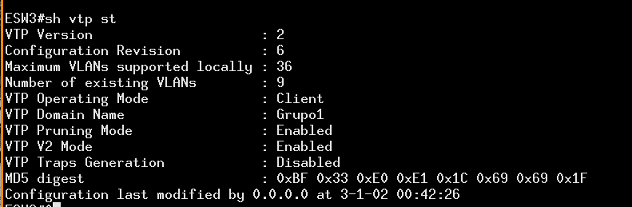
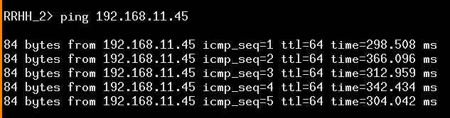

<!-- START doctoc generated TOC please keep comment here to allow auto update -->
<!-- DON'T EDIT THIS SECTION, INSTEAD RE-RUN doctoc TO UPDATE -->

- [Proyecto 1](#proyecto-1)
      - [Grupo 1](#grupo-1)
      - [Guatemala 31 de Agosto 2021](#guatemala-31-de-agosto-2021)
- [Tabla de Contenido](#tabla-de-contenido)
- [**1. Configuración inicial topologia 1**](#1-configuraci%C3%B3n-inicial-topologia-1)
  - [**1.1 Configuración ESW1**](#11-configuraci%C3%B3n-esw1)
    - [1.1.1 Configuración de puertos modo truncal](#111-configuraci%C3%B3n-de-puertos-modo-truncal)
    - [1.1.2 Configuración de protocolo vtp](#112-configuraci%C3%B3n-de-protocolo-vtp)
    - [1.1.2 demostracion de protocolo vtp](#112-demostracion-de-protocolo-vtp)
  - [**1.2 Configuración ESW2**](#12-configuraci%C3%B3n-esw2)
    - [1.2.1 Configuración de puertos modo truncal](#121-configuraci%C3%B3n-de-puertos-modo-truncal)
    - [1.2.2 Configuración de puertos modo acceso](#122-configuraci%C3%B3n-de-puertos-modo-acceso)
    - [1.2.3 Configuración de protocolo vtp](#123-configuraci%C3%B3n-de-protocolo-vtp)
    - [1.2.4 Desmostración de protocolo vtp](#124-desmostraci%C3%B3n-de-protocolo-vtp)
  - [**1.3 Configuración ESW3**](#13-configuraci%C3%B3n-esw3)
    - [1.3.1 Configuración de puertos modo truncal](#131-configuraci%C3%B3n-de-puertos-modo-truncal)
    - [1.3.2 Configuración de puertos modo acceso](#132-configuraci%C3%B3n-de-puertos-modo-acceso)
    - [1.3.3 Configuración de protocolo vtp](#133-configuraci%C3%B3n-de-protocolo-vtp)
    - [1.3.3 Demostración de protocolo vtp](#133-demostraci%C3%B3n-de-protocolo-vtp)
  - [**1.4 Configuración nube**](#14-configuraci%C3%B3n-nube)
  - [**1.5 Configuración ip de VPCS**](#15-configuraci%C3%B3n-ip-de-vpcs)
    - [1.5.1 Configuración Conta_1 y Conta_2](#151-configuraci%C3%B3n-conta_1-y-conta_2)
    - [1.5.2 Configuración Informatica_1](#152-configuraci%C3%B3n-informatica_1)
    - [1.5.3 Configuración RRHH_1 y RRHH_2](#153-configuraci%C3%B3n-rrhh_1-y-rrhh_2)
    - [1.5.4 Configuración Ventas_1](#154-configuraci%C3%B3n-ventas_1)
- [**2. Configuración inicial topologia 2**](#2-configuraci%C3%B3n-inicial-topologia-2)
  - [**2.1 Configuración ESW4**](#21-configuraci%C3%B3n-esw4)
    - [2.1.1 Crear vlans](#211-crear-vlans)
    - [2.1.2 Ver vlans](#212-ver-vlans)
    - [2.1.3 Crar modos truncales parte 1](#213-crar-modos-truncales-parte-1)
    - [2.1.4 Crar modos truncales parte2](#214-crar-modos-truncales-parte2)
    - [2.1.5 Ver modos truncales](#215-ver-modos-truncales)
    - [2.1.6 Vtp server](#216-vtp-server)
    - [2.1.7 Vtp status](#217-vtp-status)
    - [2.1.8 Vtp version 2](#218-vtp-version-2)
    - [2.1.9 Vtp pruning](#219-vtp-pruning)
    - [2.1.10 Habilitar STP](#2110-habilitar-stp)
    - [2.1.11 Configuraciones STP](#2111-configuraciones-stp)
    - [2.1.12 STP puertos block](#2112-stp-puertos-block)
  - [**2.2 Configuración ESW7**](#22-configuraci%C3%B3n-esw7)
    - [2.2.1 Configuracion modo truncal p1](#221-configuracion-modo-truncal-p1)
    - [2.2.2 Configuracion modo truncal p2](#222-configuracion-modo-truncal-p2)
    - [2.2.3 Configuracion modo truncal p3](#223-configuracion-modo-truncal-p3)
    - [2.2.4 Configuracion modo acceso](#224-configuracion-modo-acceso)
    - [2.2.5 Configuración cliente VTP](#225-configuraci%C3%B3n-cliente-vtp)
    - [2.2.6 Ver puertos TR](#226-ver-puertos-tr)
    - [2.2.7 Ver vlans](#227-ver-vlans)
    - [2.2.8 VTP status](#228-vtp-status)
  - [**2.3 Configuración ESW6**](#23-configuraci%C3%B3n-esw6)
    - [2.3.1 Configuración de puertos modo truncal parte 1](#231-configuraci%C3%B3n-de-puertos-modo-truncal-parte-1)
    - [2.3.2 Configuración de puertos modo truncal parte 2](#232-configuraci%C3%B3n-de-puertos-modo-truncal-parte-2)
    - [2.3.3 Configuración de puertos modo truncal parte 3](#233-configuraci%C3%B3n-de-puertos-modo-truncal-parte-3)
    - [2.3.4 Configuración de puertos modo truncal parte 4](#234-configuraci%C3%B3n-de-puertos-modo-truncal-parte-4)
    - [2.3.5 Configuración cliente VTP](#235-configuraci%C3%B3n-cliente-vtp)
    - [2.3.6 Configuración puertos TR](#236-configuraci%C3%B3n-puertos-tr)
    - [2.3.7 Configuración vlans](#237-configuraci%C3%B3n-vlans)
    - [2.3.8 Vlan status](#238-vlan-status)
  - [**2.4 Configuración ESW5**](#24-configuraci%C3%B3n-esw5)
    - [2.4.1 Configuración modo truncal p1](#241-configuraci%C3%B3n-modo-truncal-p1)
    - [2.4.2 Configuración modo truncal p2](#242-configuraci%C3%B3n-modo-truncal-p2)
    - [2.4.3 Configuración cliente VTP](#243-configuraci%C3%B3n-cliente-vtp)
    - [2.4.4 Puertos troncales](#244-puertos-troncales)
    - [2.4.5 Vlans de clientes](#245-vlans-de-clientes)
    - [2.4.6 VTP status](#246-vtp-status)
  - [**2.5 Configuración ip de Informatica_2**](#25-configuraci%C3%B3n-ip-de-informatica_2)
- [**3. Configuración inicial topologia 3**](#3-configuraci%C3%B3n-inicial-topologia-3)
  - [**3.1 Configuración de los switches**](#31-configuraci%C3%B3n-de-los-switches)
    - [3.1.1 Switch S1](#311-switch-s1)
    - [3.1.2 Switch S2](#312-switch-s2)
    - [3.1.3 Switch S3](#313-switch-s3)
    - [3.1.4 Switch S4](#314-switch-s4)
  - [**3.2 Configuración de los switches en modo acceso**](#32-configuraci%C3%B3n-de-los-switches-en-modo-acceso)
    - [3.2.1 Switch S1](#321-switch-s1)
    - [3.2.2 Switch S2](#322-switch-s2)
    - [3.2.3 Switch S3](#323-switch-s3)
    - [3.2.4 Switch S4](#324-switch-s4)
  - [**3.3 Configuración de los switches en modo truncal**](#33-configuraci%C3%B3n-de-los-switches-en-modo-truncal)
    - [3.3.1 Switch S1](#331-switch-s1)
    - [3.3.2 Switch S2](#332-switch-s2)
    - [3.3.3 Switch S3](#333-switch-s3)
    - [3.3.4 Switch S4](#334-switch-s4)
  - [**3.4 Configuración de vtp en los switch**](#34-configuraci%C3%B3n-de-vtp-en-los-switch)
    - [3.4.1 Switch S1](#341-switch-s1)
    - [3.4.2 Switch S2](#342-switch-s2)
    - [3.4.3 Switch S3](#343-switch-s3)
    - [3.4.4 Switch S4](#344-switch-s4)
  - [**3.5 Configuración de las VPCS(SERVERS)**](#35-configuraci%C3%B3n-de-las-vpcsservers)
    - [3.5.1 Servidor contabilidad](#351-servidor-contabilidad)
    - [3.5.2 Servidor Informatica](#352-servidor-informatica)
    - [3.5.3 Servidor RRHH](#353-servidor-rrhh)
    - [3.5.4 Servidor Ventas](#354-servidor-ventas)
- [**4. Pings topologia 1**](#4-pings-topologia-1)
  - [**4.1 Ping entre conta_1 y conta_2**](#41-ping-entre-conta_1-y-conta_2)
  - [**4.2 Ping entre conta_1 y server**](#42-ping-entre-conta_1-y-server)
  - [**4.3 Ping entre conta_2 y conta_1**](#43-ping-entre-conta_2-y-conta_1)
  - [**4.4 Ping entre conta_2 y server**](#44-ping-entre-conta_2-y-server)
  - [**4.5 Ping entre vlans**](#45-ping-entre-vlans)
  - [**4.6 Ping entre informatica_1 e informatica_2**](#46-ping-entre-informatica_1-e-informatica_2)
  - [**4.7 Ping entre informatica_1 y server**](#47-ping-entre-informatica_1-y-server)
  - [**4.8 Ping entre RRHH_1 y RRHH_2**](#48-ping-entre-rrhh_1-y-rrhh_2)
  - [**4.9 Ping entre RRHH_1 y server**](#49-ping-entre-rrhh_1-y-server)
  - [**4.10 Ping entre RRHH_2 y RRHH_1**](#410-ping-entre-rrhh_2-y-rrhh_1)
  - [**4.11 Ping entre RRHH_2 y Server**](#411-ping-entre-rrhh_2-y-server)
  - [**4.12 Ping entre ventas_1 y Server**](#412-ping-entre-ventas_1-y-server)
- [**5. Pings topologia 2**](#5-pings-topologia-2)
  - [**5.1 Ping entre informatica_1 e informatica_2**](#51-ping-entre-informatica_1-e-informatica_2)
  - [**5.2 Ping**](#52-ping)
  - [**5.3 No ping**](#53-no-ping)
- [**6. Pings topologia 3**](#6-pings-topologia-3)
  - [**6.1 Ping conta**](#61-ping-conta)
  - [**6.2 Ping informatica**](#62-ping-informatica)
  - [**6.3 Ping rrhh**](#63-ping-rrhh)
  - [**6.4 Ping ventas**](#64-ping-ventas)
  - [**6.5 Ping conta diferente departamento**](#65-ping-conta-diferente-departamento)
  - [**6.6 Ping informatica diferente departamento**](#66-ping-informatica-diferente-departamento)
  - [**6.7 Ping rrhh diferente departamento**](#67-ping-rrhh-diferente-departamento)
  - [**6.8 Ping ventas diferente departamento**](#68-ping-ventas-diferente-departamento)
- [**7. Requerimientos de equipo**](#7-requerimientos-de-equipo)
- [**8. Requerimientos para ejecutar archivos gns3**](#8-requerimientos-para-ejecutar-archivos-gns3)

<!-- END doctoc generated TOC please keep comment here to allow auto update -->

Universidad de San Carlos de Guatemala
 
Facultad de Ingeniería
 
Escuela de Ciencias y Sistemas
 
Redes de Computadoras 1
 
Ing. Miguel Marin de León
 
Aux. Juan Pablo García Monzón

    

<h1 align="center" style="font-size: 40px; font-weight: bold;">Proyecto 1</h1>

   

<h4 align="center" style="font-size: 30px; font-weight: bold;">Grupo 1</h4>

  

| Carnet | Nombre |
| :-: | :-:| 
| 201700965 | José Carlos I Alonzo Colocho |
| 201700319 | Estanley Rafael Cóbar García |
| 201709140 | Oscar Armin Crisostomo Ruiz |
| 201709309 | José Alejandro Santizo Cotto  |

  

<h4 align="center" style="font-size: 18px; font-weight: bold;">Guatemala 31 de Agosto 2021</h4>

*** 

    

*** 

<h1>Tabla de Contenido</h1>

- [Proyecto 1](#proyecto-1)
      - [Grupo 1](#grupo-1)
      - [Guatemala 31 de Agosto 2021](#guatemala-31-de-agosto-2021)
- [Tabla de Contenido](#tabla-de-contenido)
- [**1. Configuración inicial topologia 1**](#1-configuraci%C3%B3n-inicial-topologia-1)
  - [**1.1 Configuración ESW1**](#11-configuraci%C3%B3n-esw1)
    - [1.1.1 Configuración de puertos modo truncal](#111-configuraci%C3%B3n-de-puertos-modo-truncal)
    - [1.1.2 Configuración de protocolo vtp](#112-configuraci%C3%B3n-de-protocolo-vtp)
    - [1.1.2 demostracion de protocolo vtp](#112-demostracion-de-protocolo-vtp)
  - [**1.2 Configuración ESW2**](#12-configuraci%C3%B3n-esw2)
    - [1.2.1 Configuración de puertos modo truncal](#121-configuraci%C3%B3n-de-puertos-modo-truncal)
    - [1.2.2 Configuración de puertos modo acceso](#122-configuraci%C3%B3n-de-puertos-modo-acceso)
    - [1.2.3 Configuración de protocolo vtp](#123-configuraci%C3%B3n-de-protocolo-vtp)
    - [1.2.4 Desmostración de protocolo vtp](#124-desmostraci%C3%B3n-de-protocolo-vtp)
  - [**1.3 Configuración ESW3**](#13-configuraci%C3%B3n-esw3)
    - [1.3.1 Configuración de puertos modo truncal](#131-configuraci%C3%B3n-de-puertos-modo-truncal)
    - [1.3.2 Configuración de puertos modo acceso](#132-configuraci%C3%B3n-de-puertos-modo-acceso)
    - [1.3.3 Configuración de protocolo vtp](#133-configuraci%C3%B3n-de-protocolo-vtp)
    - [1.3.3 Demostración de protocolo vtp](#133-demostraci%C3%B3n-de-protocolo-vtp)
  - [**1.4 Configuración nube**](#14-configuraci%C3%B3n-nube)
  - [**1.5 Configuración ip de VPCS**](#15-configuraci%C3%B3n-ip-de-vpcs)
    - [1.5.1 Configuración Conta_1 y Conta_2](#151-configuraci%C3%B3n-conta_1-y-conta_2)
    - [1.5.2 Configuración Informatica_1](#152-configuraci%C3%B3n-informatica_1)
    - [1.5.3 Configuración RRHH_1 y RRHH_2](#153-configuraci%C3%B3n-rrhh_1-y-rrhh_2)
    - [1.5.4 Configuración Ventas_1](#154-configuraci%C3%B3n-ventas_1)
- [**2. Configuración inicial topologia 2**](#2-configuraci%C3%B3n-inicial-topologia-2)
  - [**2.1 Configuración ESW4**](#21-configuraci%C3%B3n-esw4)
    - [2.1.1 Crear vlans](#211-crear-vlans)
    - [2.1.2 Ver vlans](#212-ver-vlans)
    - [2.1.3 Crar modos truncales parte 1](#213-crar-modos-truncales-parte-1)
    - [2.1.4 Crar modos truncales parte2](#214-crar-modos-truncales-parte2)
    - [2.1.5 Ver modos truncales](#215-ver-modos-truncales)
    - [2.1.6 Vtp server](#216-vtp-server)
    - [2.1.7 Vtp status](#217-vtp-status)
    - [2.1.8 Vtp version 2](#218-vtp-version-2)
    - [2.1.9 Vtp pruning](#219-vtp-pruning)
    - [2.1.10 Habilitar STP](#2110-habilitar-stp)
    - [2.1.11 Configuraciones STP](#2111-configuraciones-stp)
    - [2.1.12 STP puertos block](#2112-stp-puertos-block)
  - [**2.2 Configuración ESW7**](#22-configuraci%C3%B3n-esw7)
    - [2.2.1 Configuracion modo truncal p1](#221-configuracion-modo-truncal-p1)
    - [2.2.2 Configuracion modo truncal p2](#222-configuracion-modo-truncal-p2)
    - [2.2.3 Configuracion modo truncal p3](#223-configuracion-modo-truncal-p3)
    - [2.2.4 Configuracion modo acceso](#224-configuracion-modo-acceso)
    - [2.2.5 Configuración cliente VTP](#225-configuraci%C3%B3n-cliente-vtp)
    - [2.2.6 Ver puertos TR](#226-ver-puertos-tr)
    - [2.2.7 Ver vlans](#227-ver-vlans)
    - [2.2.8 VTP status](#228-vtp-status)
  - [**2.3 Configuración ESW6**](#23-configuraci%C3%B3n-esw6)
    - [2.3.1 Configuración de puertos modo truncal parte 1](#231-configuraci%C3%B3n-de-puertos-modo-truncal-parte-1)
    - [2.3.2 Configuración de puertos modo truncal parte 2](#232-configuraci%C3%B3n-de-puertos-modo-truncal-parte-2)
    - [2.3.3 Configuración de puertos modo truncal parte 3](#233-configuraci%C3%B3n-de-puertos-modo-truncal-parte-3)
    - [2.3.4 Configuración de puertos modo truncal parte 4](#234-configuraci%C3%B3n-de-puertos-modo-truncal-parte-4)
    - [2.3.5 Configuración cliente VTP](#235-configuraci%C3%B3n-cliente-vtp)
    - [2.3.6 Configuración puertos TR](#236-configuraci%C3%B3n-puertos-tr)
    - [2.3.7 Configuración vlans](#237-configuraci%C3%B3n-vlans)
    - [2.3.8 Vlan status](#238-vlan-status)
  - [**2.4 Configuración ESW5**](#24-configuraci%C3%B3n-esw5)
    - [2.4.1 Configuración modo truncal p1](#241-configuraci%C3%B3n-modo-truncal-p1)
    - [2.4.2 Configuración modo truncal p2](#242-configuraci%C3%B3n-modo-truncal-p2)
    - [2.4.3 Configuración cliente VTP](#243-configuraci%C3%B3n-cliente-vtp)
    - [2.4.4 Puertos troncales](#244-puertos-troncales)
    - [2.4.5 Vlans de clientes](#245-vlans-de-clientes)
    - [2.4.6 VTP status](#246-vtp-status)
  - [**2.5 Configuración ip de Informatica_2**](#25-configuraci%C3%B3n-ip-de-informatica_2)
- [**3. Configuración inicial topologia 3**](#3-configuraci%C3%B3n-inicial-topologia-3)
  - [**3.1 Configuración de los switches**](#31-configuraci%C3%B3n-de-los-switches)
    - [3.1.1 Switch S1](#311-switch-s1)
    - [3.1.2 Switch S2](#312-switch-s2)
    - [3.1.3 Switch S3](#313-switch-s3)
    - [3.1.4 Switch S4](#314-switch-s4)
  - [**3.2 Configuración de los switches en modo acceso**](#32-configuraci%C3%B3n-de-los-switches-en-modo-acceso)
    - [3.2.1 Switch S1](#321-switch-s1)
    - [3.2.2 Switch S2](#322-switch-s2)
    - [3.2.3 Switch S3](#323-switch-s3)
    - [3.2.4 Switch S4](#324-switch-s4)
  - [**3.3 Configuración de los switches en modo truncal**](#33-configuraci%C3%B3n-de-los-switches-en-modo-truncal)
    - [3.3.1 Switch S1](#331-switch-s1)
    - [3.3.2 Switch S2](#332-switch-s2)
    - [3.3.3 Switch S3](#333-switch-s3)
    - [3.3.4 Switch S4](#334-switch-s4)
  - [**3.4 Configuración de vtp en los switch**](#34-configuraci%C3%B3n-de-vtp-en-los-switch)
    - [3.4.1 Switch S1](#341-switch-s1)
    - [3.4.2 Switch S2](#342-switch-s2)
    - [3.4.3 Switch S3](#343-switch-s3)
    - [3.4.4 Switch S4](#344-switch-s4)
  - [**3.5 Configuración de las VPCS(SERVERS)**](#35-configuraci%C3%B3n-de-las-vpcsservers)
    - [3.5.1 Servidor contabilidad](#351-servidor-contabilidad)
    - [3.5.2 Servidor Informatica](#352-servidor-informatica)
    - [3.5.3 Servidor RRHH](#353-servidor-rrhh)
    - [3.5.4 Servidor Ventas](#354-servidor-ventas)
- [**4. Pings topologia 1**](#4-pings-topologia-1)
  - [**4.1 Ping entre conta_1 y conta_2**](#41-ping-entre-conta_1-y-conta_2)
  - [**4.2 Ping entre conta_1 y server**](#42-ping-entre-conta_1-y-server)
  - [**4.3 Ping entre conta_2 y conta_1**](#43-ping-entre-conta_2-y-conta_1)
  - [**4.4 Ping entre conta_2 y server**](#44-ping-entre-conta_2-y-server)
  - [**4.5 Ping entre vlans**](#45-ping-entre-vlans)
  - [**4.6 Ping entre informatica_1 e informatica_2**](#46-ping-entre-informatica_1-e-informatica_2)
  - [**4.7 Ping entre informatica_1 y server**](#47-ping-entre-informatica_1-y-server)
  - [**4.8 Ping entre RRHH_1 y RRHH_2**](#48-ping-entre-rrhh_1-y-rrhh_2)
  - [**4.9 Ping entre RRHH_1 y server**](#49-ping-entre-rrhh_1-y-server)
  - [**4.10 Ping entre RRHH_2 y RRHH_1**](#410-ping-entre-rrhh_2-y-rrhh_1)
  - [**4.11 Ping entre RRHH_2 y Server**](#411-ping-entre-rrhh_2-y-server)
  - [**4.12 Ping entre ventas_1 y Server**](#412-ping-entre-ventas_1-y-server)
- [**5. Pings topologia 2**](#5-pings-topologia-2)
  - [**5.1 Ping entre informatica_1 e informatica_2**](#51-ping-entre-informatica_1-e-informatica_2)
  - [**5.2 Ping**](#52-ping)
  - [**5.3 No ping**](#53-no-ping)
- [**6. Pings topologia 3**](#6-pings-topologia-3)
  - [**6.1 Ping conta**](#61-ping-conta)
  - [**6.2 Ping informatica**](#62-ping-informatica)
  - [**6.3 Ping rrhh**](#63-ping-rrhh)
  - [**6.4 Ping ventas**](#64-ping-ventas)
  - [**6.5 Ping conta diferente departamento**](#65-ping-conta-diferente-departamento)
  - [**6.6 Ping informatica diferente departamento**](#66-ping-informatica-diferente-departamento)
  - [**6.7 Ping rrhh diferente departamento**](#67-ping-rrhh-diferente-departamento)
  - [**6.8 Ping ventas diferente departamento**](#68-ping-ventas-diferente-departamento)
- [**7. Requerimientos de equipo**](#7-requerimientos-de-equipo)
- [**8. Requerimientos para ejecutar archivos gns3**](#8-requerimientos-para-ejecutar-archivos-gns3)

    

# **1. Configuración inicial topologia 1**

 

***
## **1.1 Configuración ESW1**
***
### 1.1.1 Configuración de puertos modo truncal

***
### 1.1.2 Configuración de protocolo vtp

***
### 1.1.2 demostracion de protocolo vtp

***
## **1.2 Configuración ESW2**
***
### 1.2.1 Configuración de puertos modo truncal

***
### 1.2.2 Configuración de puertos modo acceso

***

***
### 1.2.3 Configuración de protocolo vtp

***

### 1.2.4 Desmostración de protocolo vtp

***

## **1.3 Configuración ESW3**

***
### 1.3.1 Configuración de puertos modo truncal

***

### 1.3.2 Configuración de puertos modo acceso

***

### 1.3.3 Configuración de protocolo vtp

***

### 1.3.3 Demostración de protocolo vtp

***

## **1.4 Configuración nube**

***

## **1.5 Configuración ip de VPCS**

***
### 1.5.1 Configuración Conta_1 y Conta_2

***

### 1.5.2 Configuración Informatica_1

***

### 1.5.3 Configuración RRHH_1 y RRHH_2

***

### 1.5.4 Configuración Ventas_1

***

# **2. Configuración inicial topologia 2**

 

***
## **2.1 Configuración ESW4**
***
### 2.1.1 Crear vlans

***
### 2.1.2 Ver vlans

***
### 2.1.3 Crar modos truncales parte 1

***

### 2.1.4 Crar modos truncales parte2

***

### 2.1.5 Ver modos truncales

***

### 2.1.6 Vtp server

***

### 2.1.7 Vtp status

***

### 2.1.8 Vtp version 2

***

### 2.1.9 Vtp pruning

***

### 2.1.10 Habilitar STP

***

### 2.1.11 Configuraciones STP

***

### 2.1.12 STP puertos block

***

## **2.2 Configuración ESW7**
***
### 2.2.1 Configuracion modo truncal p1

***
### 2.2.2 Configuracion modo truncal p2

***

### 2.2.3 Configuracion modo truncal p3

***

### 2.2.4 Configuracion modo acceso

***

### 2.2.5 Configuración cliente VTP

***

### 2.2.6 Ver puertos TR

***

### 2.2.7 Ver vlans

***

### 2.2.8 VTP status

***

## **2.3 Configuración ESW6**

***
### 2.3.1 Configuración de puertos modo truncal parte 1

***

### 2.3.2 Configuración de puertos modo truncal parte 2

***

### 2.3.3 Configuración de puertos modo truncal parte 3

***

### 2.3.4 Configuración de puertos modo truncal parte 4

***

### 2.3.5 Configuración cliente VTP

***

### 2.3.6 Configuración puertos TR

### 2.3.7 Configuración vlans

### 2.3.8 Vlan status

## **2.4 Configuración ESW5**

***

### 2.4.1 Configuración modo truncal p1

***

### 2.4.2 Configuración modo truncal p2

***

### 2.4.3 Configuración cliente VTP

***

### 2.4.4 Puertos troncales

***

### 2.4.5 Vlans de clientes

***

### 2.4.6 VTP status

***

## **2.5 Configuración ip de Informatica_2**

***

# **3. Configuración inicial topologia 3**

 

***
## **3.1 Configuración de los switches**
***
### 3.1.1 Switch S1

***

### 3.1.2 Switch S2

***

### 3.1.3 Switch S3

***

### 3.1.4 Switch S4

***

## **3.2 Configuración de los switches en modo acceso**
***
### 3.2.1 Switch S1

***

### 3.2.2 Switch S2

***

### 3.2.3 Switch S3

***

### 3.2.4 Switch S4

***

## **3.3 Configuración de los switches en modo truncal**
***
### 3.3.1 Switch S1

***

### 3.3.2 Switch S2

***

### 3.3.3 Switch S3

***

### 3.3.4 Switch S4

***

## **3.4 Configuración de vtp en los switch**
***
### 3.4.1 Switch S1

***

### 3.4.2 Switch S2

***

### 3.4.3 Switch S3

***

### 3.4.4 Switch S4

***

## **3.5 Configuración de las VPCS(SERVERS)**
***
### 3.5.1 Servidor contabilidad

***

### 3.5.2 Servidor Informatica

***

### 3.5.3 Servidor RRHH

***

### 3.5.4 Servidor Ventas

***

# **4. Pings topologia 1**

 

## **4.1 Ping entre conta_1 y conta_2**

***

## **4.2 Ping entre conta_1 y server**

***

## **4.3 Ping entre conta_2 y conta_1**

***

## **4.4 Ping entre conta_2 y server**

***

## **4.5 Ping entre vlans**

***

## **4.6 Ping entre informatica_1 e informatica_2**

***

## **4.7 Ping entre informatica_1 y server**

***

## **4.8 Ping entre RRHH_1 y RRHH_2**

***

## **4.9 Ping entre RRHH_1 y server**

***

## **4.10 Ping entre RRHH_2 y RRHH_1**

***

## **4.11 Ping entre RRHH_2 y Server**

***

## **4.12 Ping entre ventas_1 y Server**

***

# **5. Pings topologia 2**

 

## **5.1 Ping entre informatica_1 e informatica_2**

***

## **5.2 Ping**

***

## **5.3 No ping**

***

# **6. Pings topologia 3**

 

## **6.1 Ping conta**

***

## **6.2 Ping informatica**

***

## **6.3 Ping rrhh**

***

## **6.4 Ping ventas**

***

## **6.5 Ping conta diferente departamento**

***

## **6.6 Ping informatica diferente departamento**

***

## **6.7 Ping rrhh diferente departamento**

***

## **6.8 Ping ventas diferente departamento**

***

# **7. Requerimientos de equipo**

# **8. Requerimientos para ejecutar archivos gns3**

