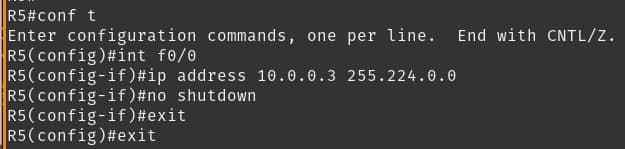
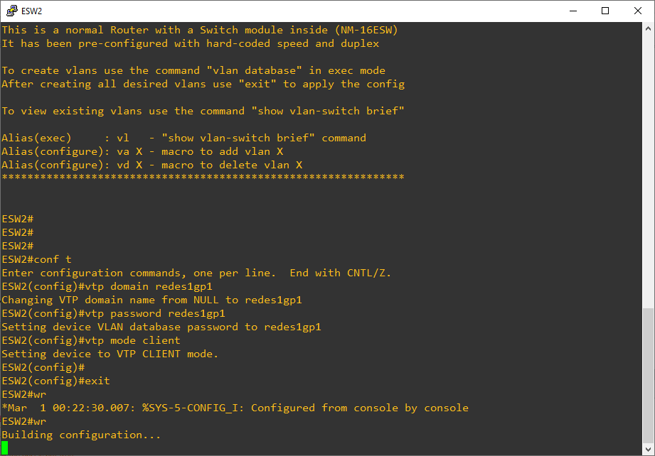

Universidad de San Carlos de Guatemala
 
Facultad de Ingeniería
 
Escuela de Ciencias y Sistemas
 
Redes de Computadoras 1
 
Ing. Miguel Marin de León
 
Aux. Juan Pablo García Monzón

    

<h1 align="center" style="font-size: 40px; font-weight: bold;">Proyecto 2</h1>

   

<h4 align="center" style="font-size: 30px; font-weight: bold;">Grupo 1</h4>

  

| Carnet | Nombre |
| :-: | :-:| 
| 201700965 | José Carlos I Alonzo Colocho |
| 201700319 | Estanley Rafael Cóbar García |
| 201709140 | Oscar Armin Crisostomo Ruiz |
| 201709309 | José Alejandro Santizo Cotto  |

  

<h4 align="center" style="font-size: 18px; font-weight: bold;">Guatemala 6 de noviembre 2021</h4>

*** 

    

*** 

<h1>Tabla de Contenido</h1>

- [**1. Topologia 1**](#1-topologia-1)
  - [**1.1 GLBP**](#11-glbp)
    - [***1.1.1 r3***](#111-r3)
    - [***1.1.2 r6***](#112-r6)
  - [**1.2 HSRP**](#12-hsrp)
    - [***1.2.1 HSRP activo r7***](#121-hsrp-activo-r7)
    - [***1.2.2 HSRP pasivo r5***](#122-hsrp-pasivo-r5)
  - [**1.3 Redistribucion**](#13-redistribucion)
    - [***1.3.1 r6***](#131-r6)
    - [***1.3.2 r7***](#132-r7)
  - [**1.4 Ruteo**](#14-ruteo)
    - [***1.4.1 Dinámico r3***](#141-din%C3%A1mico-r3)
    - [***1.4.2 Dinámico r4***](#142-din%C3%A1mico-r4)
    - [***1.4.3 Dinámico r5***](#143-din%C3%A1mico-r5)
    - [***1.4.4 Estático r6***](#144-est%C3%A1tico-r6)
    - [***1.4.5 Estático r7***](#145-est%C3%A1tico-r7)
  - [**1.5 Subred**](#15-subred)
    - [***1.5.1 Subred 1 r3***](#151-subred-1-r3)
    - [***1.5.2 Subred 1 r4***](#152-subred-1-r4)
    - [***1.5.3 Subred 1 r5***](#153-subred-1-r5)
    - [***1.5.4 Subred 1 r6***](#154-subred-1-r6)
    - [***1.5.5 Subred 2 r3***](#155-subred-2-r3)
    - [***1.5.6 Subred 2 r4***](#156-subred-2-r4)
    - [***1.5.7 Subred 2 r5***](#157-subred-2-r5)
    - [***1.5.8 Subred 2 r7***](#158-subred-2-r7)
    - [***1.5.9 Subred 3 r3***](#159-subred-3-r3)
    - [***1.5.10 Subred 4 r6***](#1510-subred-4-r6)
    - [***1.5.11 Subred 5 r5***](#1511-subred-5-r5)
    - [***1.5.12 Subred 6 r7***](#1512-subred-6-r7)
- [**2. Topologia 2**](#2-topologia-2)
  - [**2.1 TR**](#21-tr)
    - [***2.1.1 CONF1 ESW2***](#211-conf1-esw2)
    - [***2.1.2 CONF1 ESW3***](#212-conf1-esw3)
    - [***2.1.3 CONF1 ESW4***](#213-conf1-esw4)
    - [***2.1.4 CONF1 ESW5***](#214-conf1-esw5)
    - [***2.1.5 CONF2 ESW2***](#215-conf2-esw2)
    - [***2.1.6 CONF2 ESW3***](#216-conf2-esw3)
    - [***2.1.7 CONF2 ESW5***](#217-conf2-esw5)
  - [**2.2 Creación Vlans ESW4**](#22-creaci%C3%B3n-vlans-esw4)
  - [**2.3 IP's**](#23-ips)
    - [***2.3.1 IP Conta***](#231-ip-conta)
    - [***2.3.2 IP Info1***](#232-ip-info1)
    - [***2.3.3 IP Info2***](#233-ip-info2)
    - [***2.3.4 IP RRHH***](#234-ip-rrhh)
    - [***2.3.5 IP Ventas***](#235-ip-ventas)
    - [***2.3.6 IP Ventas2***](#236-ip-ventas2)
  - [**2.5 Ping's**](#25-pings)
    - [***2.5.1 Ping Conta***](#251-ping-conta)
    - [***2.5.2 Ping Conta***](#252-ping-conta)
    - [***2.5.3 Ping Conta***](#253-ping-conta)
    - [***2.5.4 Ping Conta***](#254-ping-conta)
    - [***2.5.5 Ping Conta***](#255-ping-conta)
    - [***2.5.6 Ping Conta***](#256-ping-conta)
  - [**2.6 PO**](#26-po)
    - [***2.6.1 PO 1-2 ESW4***](#261-po-1-2-esw4)
    - [***2.6.2 PO 1-4-5 ESW3***](#262-po-1-4-5-esw3)
    - [***2.6.3 PO 2-3-5 ESW2***](#263-po-2-3-5-esw2)
    - [***2.6.4 PO 3-4 ESW5***](#264-po-3-4-esw5)
  - [**2.7 ROOT BRIDGE**](#27-root-bridge)
    - [***2.7.1 ESW2***](#271-esw2)
    - [***2.7.2 ESW4***](#272-esw4)
  - [**2.8 Router2 Stick**](#28-router2-stick)
  - [**2.9 TR**](#29-tr)
    - [***2.9.1 ESW2***](#291-esw2)
    - [***2.9.2 ESW3***](#292-esw3)
    - [***2.9.3 ESW4***](#293-esw4)
    - [***2.9.4 ESW5***](#294-esw5)
  - [**2.10 Vlans**](#210-vlans)
  - [**2.11 VTP**](#211-vtp)
    - [***2.11.1 ESW2***](#2111-esw2)
    - [***2.11.2 ESW3***](#2112-esw3)
    - [***2.11.3 ESW4***](#2113-esw4)
    - [***2.11.4 ESW5***](#2114-esw5)
- [**3. Topologia 3**](#3-topologia-3)
  - [**3.1 IP**](#31-ip)
    - [***3.1.1 Admin1***](#311-admin1)
    - [***3.1.2 Admin2***](#312-admin2)
    - [***3.1.3 SRVBD***](#313-srvbd)
    - [***3.1.4 SRVCONTA***](#314-srvconta)
    - [***3.1.5 SRVRRHH***](#315-srvrrhh)
    - [***3.1.6 SRVWEB***](#316-srvweb)
  - [**3.2 PING'S**](#32-pings)
    - [***3.2.1 Admin1 Admin2***](#321-admin1-admin2)
    - [***3.2.2 Admin1 Server***](#322-admin1-server)
    - [***3.2.3 Admin1 Server2***](#323-admin1-server2)
    - [***3.2.4 Admin2 Admin1***](#324-admin2-admin1)
    - [***3.2.5 Admin2 Server***](#325-admin2-server)
    - [***3.2.6 ServerBD HostInformatica***](#326-serverbd-hostinformatica)
    - [***3.2.7 ServerConta HostConta***](#327-serverconta-hostconta)
    - [***3.2.8 ServerRRHH HostRRHH***](#328-serverrrhh-hostrrhh)
    - [***3.2.9 ServerWeb HostVentas***](#329-serverweb-hostventas)
  - [**3.3 ROUTER**](#33-router)
    - [***3.3.1 Creación Interfaces***](#331-creaci%C3%B3n-interfaces)
    - [***3.3.2 Encapsulación Interfaces***](#332-encapsulaci%C3%B3n-interfaces)
    - [***3.3.3 Estático nube1***](#333-est%C3%A1tico-nube1)
    - [***3.3.4 Estático nube2***](#334-est%C3%A1tico-nube2)
    - [***3.3.5 Estático Saltos***](#335-est%C3%A1tico-saltos)
    - [***3.3.6 ServerBD Mostrar Encapsulación Interfaces***](#336-serverbd-mostrar-encapsulaci%C3%B3n-interfaces)
    - [***3.3.7 Ver Interfaces***](#337-ver-interfaces)
  - [**3.4 SWITCH**](#34-switch)
    - [***3.4.1 Creación Vlans***](#341-creaci%C3%B3n-vlans)
    - [***3.4.2 Interfaces modo acces***](#342-interfaces-modo-acces)
    - [***3.4.3 Interfaces modo trunk***](#343-interfaces-modo-trunk)
    - [***3.4.4 Mostrar Interfaces***](#344-mostrar-interfaces)
    - [***3.4.5 Ver Vlans***](#345-ver-vlans)
  - [**3.5 Subnetting**](#35-subnetting)
- [**4. Requerimientos de equipo**](#4-requerimientos-de-equipo)
- [**5. Requerimientos para ejecutar archivos gns3**](#5-requerimientos-para-ejecutar-archivos-gns3)

    

***
# **1. Topologia 1**

***
## **1.1 GLBP**

***
### ***1.1.1 r3***

***
### ***1.1.2 r6***

***

## **1.2 HSRP**

***
### ***1.2.1 HSRP activo r7***

***
### ***1.2.2 HSRP pasivo r5***

***

## **1.3 Redistribucion**

***
### ***1.3.1 r6***

***
### ***1.3.2 r7***

***

## **1.4 Ruteo**

***
### ***1.4.1 Dinámico r3***

***
### ***1.4.2 Dinámico r4***

***
### ***1.4.3 Dinámico r5***

***
### ***1.4.4 Estático r6***

***
### ***1.4.5 Estático r7***

***

## **1.5 Subred**

***
### ***1.5.1 Subred 1 r3***

***
### ***1.5.2 Subred 1 r4***

***
### ***1.5.3 Subred 1 r5***

***
### ***1.5.4 Subred 1 r6***

***
### ***1.5.5 Subred 2 r3***

***
### ***1.5.6 Subred 2 r4***

***
### ***1.5.7 Subred 2 r5***

***
### ***1.5.8 Subred 2 r7***

***
### ***1.5.9 Subred 3 r3***

***
### ***1.5.10 Subred 4 r6***

***
### ***1.5.11 Subred 5 r5***

***
### ***1.5.12 Subred 6 r7***

 

***
# **2. Topologia 2**

***
## **2.1 TR**

***
### ***2.1.1 CONF1 ESW2***

***
### ***2.1.2 CONF1 ESW3***

***
### ***2.1.3 CONF1 ESW4***

***
### ***2.1.4 CONF1 ESW5***

***
### ***2.1.5 CONF2 ESW2***

***
### ***2.1.6 CONF2 ESW3***

***
### ***2.1.7 CONF2 ESW5***

***
## **2.2 Creación Vlans ESW4**

***

***
## **2.3 IP's**

***
### ***2.3.1 IP Conta***

***
### ***2.3.2 IP Info1***

***
### ***2.3.3 IP Info2***

***
### ***2.3.4 IP RRHH***

***
### ***2.3.5 IP Ventas***

***
### ***2.3.6 IP Ventas2***

***
## **2.5 Ping's**

***
### ***2.5.1 Ping Conta***

***
### ***2.5.2 Ping Conta***

***
### ***2.5.3 Ping Conta***

***
### ***2.5.4 Ping Conta***

***
### ***2.5.5 Ping Conta***

***
### ***2.5.6 Ping Conta***

***
## **2.6 PO**

***
### ***2.6.1 PO 1-2 ESW4***

***
### ***2.6.2 PO 1-4-5 ESW3***

***
### ***2.6.3 PO 2-3-5 ESW2***

***
### ***2.6.4 PO 3-4 ESW5***

***
## **2.7 ROOT BRIDGE**

***
### ***2.7.1 ESW2***

***
### ***2.7.2 ESW4***

***
## **2.8 Router2 Stick**

***
## **2.9 TR**

***
### ***2.9.1 ESW2***

***
### ***2.9.2 ESW3***

***
### ***2.9.3 ESW4***

***
### ***2.9.4 ESW5***

***
## **2.10 Vlans**

***
## **2.11 VTP**

***
### ***2.11.1 ESW2***

***
### ***2.11.2 ESW3***

***
### ***2.11.3 ESW4***

***
### ***2.11.4 ESW5***

 

***
# **3. Topologia 3**

***
## **3.1 IP**

***
### ***3.1.1 Admin1***

***
### ***3.1.2 Admin2***

***
### ***3.1.3 SRVBD***

***
### ***3.1.4 SRVCONTA***

***
### ***3.1.5 SRVRRHH***

***
### ***3.1.6 SRVWEB***

***
## **3.2 PING'S**

***
### ***3.2.1 Admin1 Admin2***

***
### ***3.2.2 Admin1 Server***

***
### ***3.2.3 Admin1 Server2***

***
### ***3.2.4 Admin2 Admin1***

***
### ***3.2.5 Admin2 Server***

***
### ***3.2.6 ServerBD HostInformatica***

***
### ***3.2.7 ServerConta HostConta***

***
### ***3.2.8 ServerRRHH HostRRHH***

***
### ***3.2.9 ServerWeb HostVentas***

***
## **3.3 ROUTER**

***
### ***3.3.1 Creación Interfaces***

***
### ***3.3.2 Encapsulación Interfaces***

***
### ***3.3.3 Estático nube1***

***
### ***3.3.4 Estático nube2***

***
### ***3.3.5 Estático Saltos***

***
### ***3.3.6 ServerBD Mostrar Encapsulación Interfaces***

***
### ***3.3.7 Ver Interfaces***

***
## **3.4 SWITCH**

***
### ***3.4.1 Creación Vlans***

***
### ***3.4.2 Interfaces modo acces***

***
### ***3.4.3 Interfaces modo trunk***

***
### ***3.4.4 Mostrar Interfaces***

***
### ***3.4.5 Ver Vlans***

***
## **3.5 Subnetting**

# **4. Requerimientos de equipo**

# **5. Requerimientos para ejecutar archivos gns3**

